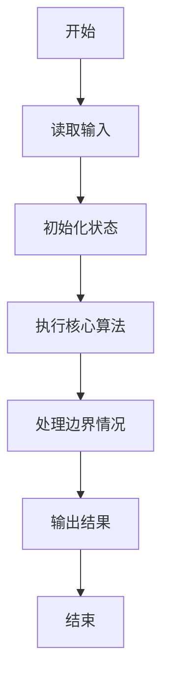
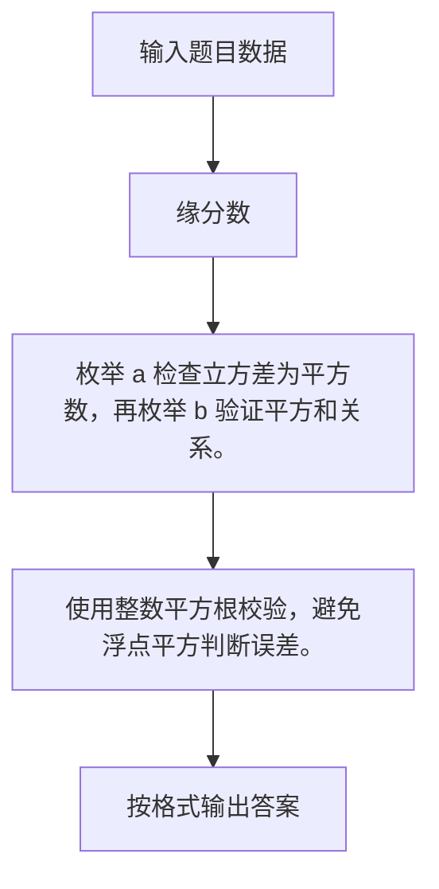

# 1103 缘分数

- **分值：** 20分

### 题目描述

所谓**缘分数**是指这样一对正整数 $a$ 和 $b$，其中 $a$ 和它的小弟 $a-1$ 的立方差正好是另一个整数 $c$ 的平方，而 $c$ 正好是 $b$ 和它的小弟 $b-1$ 的平方和。例如 $8^3 - 7^3 = 169 = 13^2$，而 $13 = 3^2 + 2^2$，于是 8 和 3 就是一对缘分数。

给定 $a$ 所在的区间 $[m,n]$，是否存在缘分数？

### 输入格式：

输入给出区间的两个端点 $0<m<n\le 25000$，其间以空格分隔。

### 输出格式：

按照 $a$ 从小到大的顺序，每行输出一对缘分数，数字间以空格分隔。如果无解，则输出 `No Solution`。

### 输入样例：1
```
8 200
```

### 输出样例：1
```
8 3
105 10
```

### 输入样例：2
```
9 100
```

### 输出样例：2
```
No Solution
```


### 解题思路

枚举 a 检查立方差为平方数，再枚举 b 验证平方和关系。 使用整数平方根校验，避免浮点平方判断误差。

实现时按照题目的输入顺序读取数据，使用与数据规模匹配的数据结构保存必要状态，在遍历或模拟过程中完成核心计算，最后严格按照输出格式生成答案。

### 代码流程说明

1. 读取题目输入，初始化计数器、数组、集合或其他辅助状态。
2. 枚举 a 检查立方差为平方数，再枚举 b 验证平方和关系。
3. 使用整数平方根校验，避免浮点平方判断误差。
4. 根据题目要求处理边界情况，并输出最终结果。

时间复杂度为 O((n-m)√c)，空间复杂度主要取决于输入数据和辅助状态，通常为 O(1) 到 O(n)。

### 代码实现

以下是本题对应的完整 C++17 实现：

```cpp
#include <bits/stdc++.h>
using namespace std;
// 算法原理：枚举 a 检查立方差为平方数，再枚举 b 验证平方和关系。
// 关键步骤：使用整数平方根校验，避免浮点平方判断误差。
bool sq(long long x) {
    long long r = sqrt((long double)x);
    return r * r == x || (r + 1) * (r + 1) == x;
}
int main() {
    int m, n;
    cin >> m >> n;
    bool any = false;
    for (long long a = m; a <= n; ++a) {
        long long z = a * a * a - (a - 1) * (a - 1) * (a - 1);
        if (!sq(z))
            continue;
        long long c = sqrt((long double)z);
        for (long long b = 1; b * b + (b - 1) * (b - 1) <= c; ++b)
            if (b * b + (b - 1) * (b - 1) == c) {
                cout << a << ' ' << b << '\n';
                any = true;
            }
    }
    if (!any)
        cout << "No Solution";
}
```

### 代码流程图



### 解题流程图



### 常见易错点

- 注意输入规模，超大整数、长字符串或链表地址不能简单依赖普通整数和下标。
- 严格区分题目中的边界条件，例如是否包含等号、是否需要保留前导零以及是否只处理完整区块。
- 输出时按照题目规定的空格、换行、大小写和小数位数格式，避免计算正确但格式错误。
