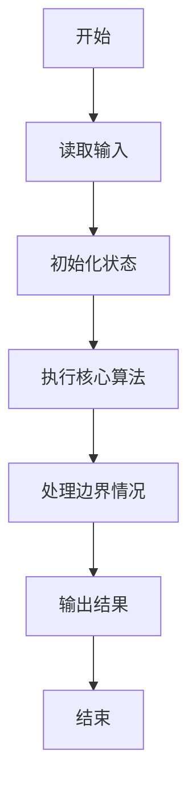
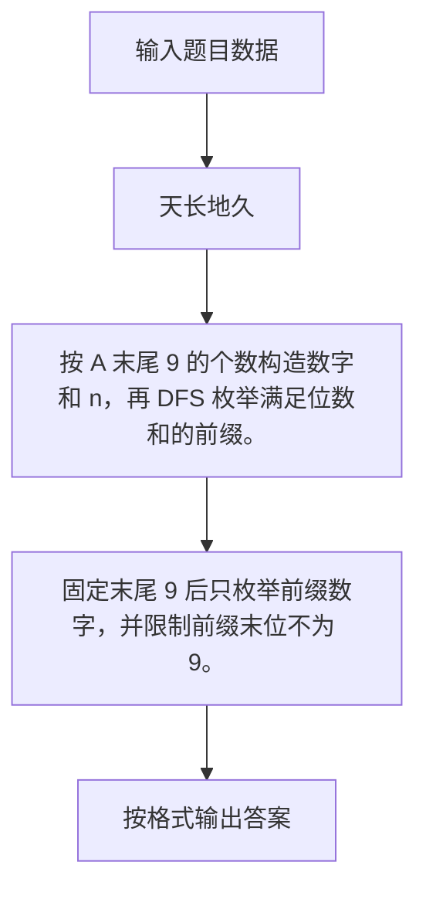

# 1104 天长地久

- **分值：** 20分

### 题目描述

“天长地久数”是指一个 $K$ 位正整数 $A$，其满足条件为：$A$ 的各位数字之和为 $m$，$A+1$ 的各位数字之和为 $n$，且 $m$ 与 $n$ 的最大公约数是一个大于 2 的素数。本题就请你找出这些天长地久数。

### 输入格式：

输入在第一行给出正整数 $N$（$\le 5$），随后 $N$ 行，每行给出一对 $K$（$3<K<10$）和 $m$（$1<m<90$），其含义如题面所述。

### 输出格式：

对每一对输入的 $K$ 和 $m$，首先在一行中输出 `Case X`，其中 `X` 是输出的编号（从 1 开始）；然后一行输出对应的 $n$ 和 $A$，数字间以空格分隔。如果解不唯一，则每组解占一行，按 $n$ 的递增序输出；若仍不唯一，则按 $A$ 的递增序输出。若解不存在，则在一行中输出 `No Solution`。

### 输入样例：
```
2
6 45
7 80
```

### 输出样例：
```
Case 1
10 189999
10 279999
10 369999
10 459999
10 549999
10 639999
10 729999
10 819999
10 909999
Case 2
No Solution
```


### 解题思路

按 A 末尾 9 的个数构造数字和 n，再 DFS 枚举满足位数和的前缀。 固定末尾 9 后只枚举前缀数字，并限制前缀末位不为 9。

实现时按照题目的输入顺序读取数据，使用与数据规模匹配的数据结构保存必要状态，在遍历或模拟过程中完成核心计算，最后严格按照输出格式生成答案。

### 代码流程说明

1. 读取题目输入，初始化计数器、数组、集合或其他辅助状态。
2. 按 A 末尾 9 的个数构造数字和 n，再 DFS 枚举满足位数和的前缀。
3. 固定末尾 9 后只枚举前缀数字，并限制前缀末位不为 9。
4. 根据题目要求处理边界情况，并输出最终结果。

时间复杂度为 O(输出规模)，空间复杂度主要取决于输入数据和辅助状态，通常为 O(1) 到 O(n)。

### 代码实现

以下是本题对应的完整 C++17 实现：

```cpp
#include <bits/stdc++.h>
using namespace std;
// 算法原理：按 A 末尾 9 的个数构造数字和 n，再 DFS 枚举满足位数和的前缀。
// 关键步骤：固定末尾 9 后只枚举前缀数字，并限制前缀末位不为 9。
bool prime(int x) {
    if (x < 2)
        return false;
    for (int i = 2; i * i <= x; ++i)
        if (x % i == 0)
            return false;
    return true;
}
int ds(long long x) {
    int s = 0;
    while (x)
        s += x % 10, x /= 10;
    return s;
}
int main() {
    int q;
    cin >> q;
    for (int cs = 1; cs <= q; ++cs) {
        int k, m;
        cin >> k >> m;
        vector<pair<int, long long>> ans;
        for (int nine = 1; nine <= k; ++nine) {
            int n = m + 1 - 9 * nine;
            if (n <= 0)
                continue;
            int g = gcd(m, n);
            if (!(g > 2 && prime(g)))
                continue;
            int len = k - nine, target = m - 9 * nine;
            if (target < 1 || target > 9 * len)
                continue;
            string pref(len, '0');
            function<void(int, int)> dfs = [&](int pos, int sum) {
                if (pos == len) {
                    if (sum != target || pref.back() == '9')
                        return;
                    string s = pref + string(nine, '9');
                    ans.push_back({n, stoll(s)});
                    return;
                }
                int lo = pos == 0 ? 1 : 0, hi = 9;
                if (pos == len - 1)
                    hi = 8;
                for (int d = lo; d <= hi && sum + d <= target; ++d) {
                    int left = len - pos - 1;
                    if (target - sum - d < 0 || target - sum - d > 9 * left)
                        continue;
                    pref[pos] = '0' + d;
                    dfs(pos + 1, sum + d);
                }
            };
            dfs(0, 0);
        }
        sort(ans.begin(), ans.end());
        cout << "Case " << cs << '\n';
        if (ans.empty())
            cout << "No Solution\n";
        else
            for (auto &x : ans)
                cout << x.first << ' ' << x.second << '\n';
    }
}
```

### 代码流程图



### 解题流程图



### 常见易错点

- 注意输入规模，超大整数、长字符串或链表地址不能简单依赖普通整数和下标。
- 严格区分题目中的边界条件，例如是否包含等号、是否需要保留前导零以及是否只处理完整区块。
- 输出时按照题目规定的空格、换行、大小写和小数位数格式，避免计算正确但格式错误。
