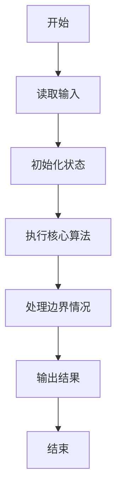
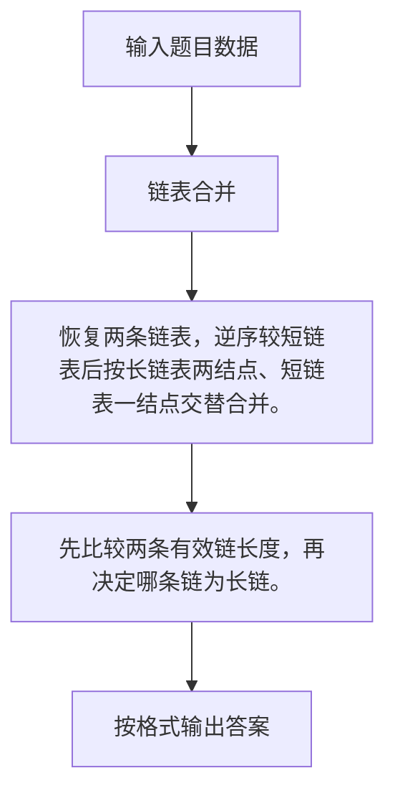

# 1105 链表合并

- **分值：** 25分

### 题目描述

给定两个单链表 $L_1 = a_1 \to a_2\to \cdots \to a_{n-1}\to a_n$ 和 $L_2 = b_1 \to b_2\to \cdots \to b_{m-1}\to b_m$。如果 $n\ge 2m$，你的任务是将比较短的那个链表逆序，然后将之并入比较长的那个链表，得到一个形如 $a_1 \to a_2 \to b_{m} \to a_3 \to a_4 \to b_{m-1}\cdots $ 的结果。例如给定两个链表分别为 6→7 和 1→2→3→4→5，你应该输出 1→2→7→3→4→6→5。

### 输入格式：

输入首先在第一行中给出两个链表 $L_1$ 和 $L_2$ 的头结点的地址，以及正整数
$N$ ($\le 10^5$)，即给定的结点总数。一个结点的地址是一个 5 位数的非负整数，空地址 NULL 用 `-1` 表示。

随后 $N$ 行，每行按以下格式给出一个结点的信息：

```
Address Data Next
```

其中 `Address` 是结点的地址，`Data` 是不超过 $10^5$ 的正整数，`Next` 是下一个结点的地址。题目保证没有空链表，并且较长的链表至少是较短链表的两倍长。

### 输出格式：

按顺序输出结果链表，每个结点占一行，格式与输入相同。

### 输入样例：
```
00100 01000 7
02233 2 34891
00100 6 00001
34891 3 10086
01000 1 02233
00033 5 -1
10086 4 00033
00001 7 -1
```

### 输出样例：
```
01000 1 02233
02233 2 00001
00001 7 34891
34891 3 10086
10086 4 00100
00100 6 00033
00033 5 -1
```


### 解题思路

恢复两条链表，逆序较短链表后按长链表两结点、短链表一结点交替合并。 先比较两条有效链长度，再决定哪条链为长链。

实现时按照题目的输入顺序读取数据，使用与数据规模匹配的数据结构保存必要状态，在遍历或模拟过程中完成核心计算，最后严格按照输出格式生成答案。

### 代码流程说明

1. 读取题目输入，初始化计数器、数组、集合或其他辅助状态。
2. 恢复两条链表，逆序较短链表后按长链表两结点、短链表一结点交替合并。
3. 先比较两条有效链长度，再决定哪条链为长链。
4. 根据题目要求处理边界情况，并输出最终结果。

时间复杂度为 O(N)，空间复杂度主要取决于输入数据和辅助状态，通常为 O(1) 到 O(n)。

### 代码实现

以下是本题对应的完整 C++17 实现：

```cpp
#include <bits/stdc++.h>
using namespace std;
// 算法原理：恢复两条链表，逆序较短链表后按长链表两结点、短链表一结点交替合并。
// 关键步骤：先比较两条有效链长度，再决定哪条链为长链。
struct N {
    int d, n;
};
string adr(int x) {
    if (x < 0)
        return "-1";
    ostringstream o;
    o << setw(5) << setfill('0') << x;
    return o.str();
}
vector<int> read(int h, vector<N> &a) {
    vector<int> v;
    for (int x = h; x != -1; x = a[x].n)
        v.push_back(x);
    return v;
}
int main() {
    int h1, h2, n;
    cin >> h1 >> h2 >> n;
    vector<N> a(100000);
    for (int i = 0, x; i < n; ++i)
        cin >> x >> a[x].d >> a[x].n;
    auto u = read(h1, a), v = read(h2, a);
    if (u.size() < v.size())
        swap(u, v);
    reverse(v.begin(), v.end());
    vector<int> o;
    int i = 0, j = 0;
    while (i < (int)u.size()) {
        o.push_back(u[i++]);
        if (i < (int)u.size())
            o.push_back(u[i++]);
        if (j < (int)v.size())
            o.push_back(v[j++]);
    }
    while (j < (int)v.size())
        o.push_back(v[j++]);
    for (int i = 0; i < (int)o.size(); ++i)
        cout << adr(o[i]) << ' ' << a[o[i]].d << ' ' << adr(i + 1 < (int)o.size() ? o[i + 1] : -1)
             << '\n';
}
```

### 代码流程图



### 解题流程图



### 常见易错点

- 注意输入规模，超大整数、长字符串或链表地址不能简单依赖普通整数和下标。
- 严格区分题目中的边界条件，例如是否包含等号、是否需要保留前导零以及是否只处理完整区块。
- 输出时按照题目规定的空格、换行、大小写和小数位数格式，避免计算正确但格式错误。
