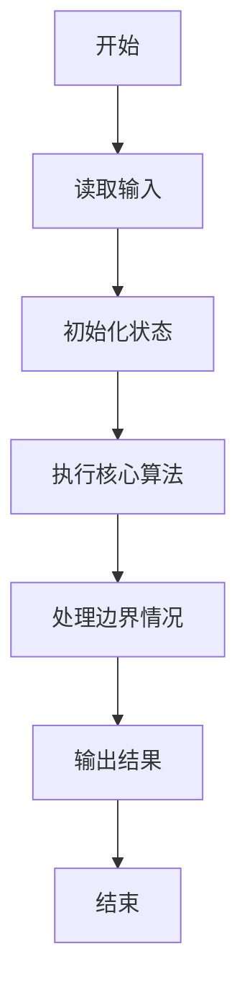
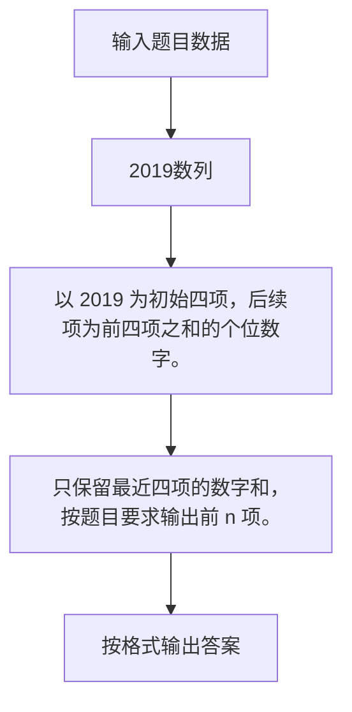

# 1106 2019数列

- **分值：** 15分

### 题目描述

把 2019 各个数位上的数字 2、0、1、9 作为一个数列的前 4 项，用它们去构造一个无穷数列，其中第 $n$（$>4$）项是它前 4 项之和的个位数字。例如第 5 项为 2， 因为 $2+0+1+9=12$，个位数是 2。

本题就请你编写程序，列出这个序列的前 $n$ 项。

### 输入格式：

输入给出正整数 $n$（$\le 1000$）。

### 输出格式：

在一行中输出数列的前 $n$ 项，数字间不要有空格。

### 输入样例：
```
10
```

### 输出样例：
```
2019224758
```

**题外话：**这个数列中永远不会出现 `2018`，你能证明吗？


### 解题思路

以 2019 为初始四项，后续项为前四项之和的个位数字。 只保留最近四项的数字和，按题目要求输出前 n 项。

实现时按照题目的输入顺序读取数据，使用与数据规模匹配的数据结构保存必要状态，在遍历或模拟过程中完成核心计算，最后严格按照输出格式生成答案。

### 代码流程说明

1. 读取题目输入，初始化计数器、数组、集合或其他辅助状态。
2. 以 2019 为初始四项，后续项为前四项之和的个位数字。
3. 只保留最近四项的数字和，按题目要求输出前 n 项。
4. 根据题目要求处理边界情况，并输出最终结果。

时间复杂度为 O(n)，空间复杂度主要取决于输入数据和辅助状态，通常为 O(1) 到 O(n)。

### 代码实现

以下是本题对应的完整 C++17 实现：

```cpp
#include <bits/stdc++.h>
using namespace std;
// 算法原理：以 2019 为初始四项，后续项为前四项之和的个位数字。
// 关键步骤：只保留最近四项的数字和，按题目要求输出前 n 项。
int main() {
    int n;
    cin >> n;
    string s = "2019";
    for (int i = 4; i < n; ++i) {
        int z = 0;
        for (int j = i - 4; j < i; ++j)
            z += s[j] - '0';
        s += char('0' + z % 10);
    }
    cout << s.substr(0, n);
}
```

### 代码流程图



### 解题流程图



### 常见易错点

- 注意输入规模，超大整数、长字符串或链表地址不能简单依赖普通整数和下标。
- 严格区分题目中的边界条件，例如是否包含等号、是否需要保留前导零以及是否只处理完整区块。
- 输出时按照题目规定的空格、换行、大小写和小数位数格式，避免计算正确但格式错误。
