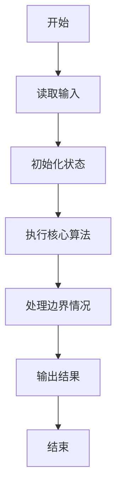
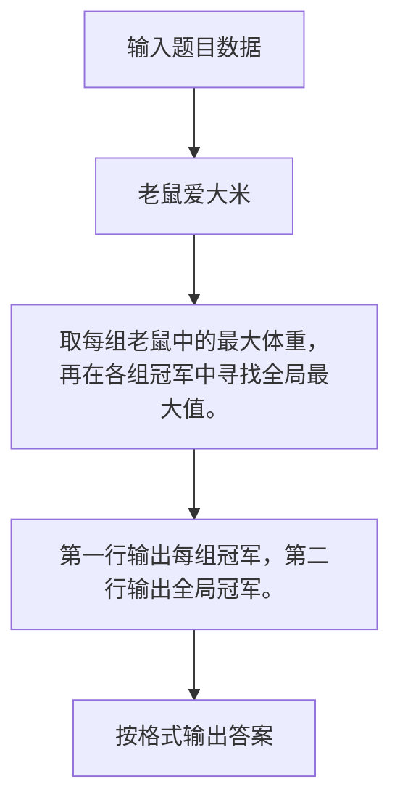

# 1107 老鼠爱大米

- **分值：** 20分

### 题目描述

翁恺老师曾经设计过一款 Java 挑战游戏，叫“老鼠爱大米”（或许因为他的外号叫“胖胖鼠”）。每个玩家用 Java 代码控制一只鼠，目标是抢吃尽可能多的大米让自己变成胖胖鼠，最胖的那只就是冠军。

因为游戏时间不能太长，我们把玩家分成 $N$ 组，每组 $M$ 只老鼠同场竞技，然后从 $N$ 个分组冠军中直接选出最胖的冠军胖胖鼠。现在就请你写个程序来得到冠军的体重。

### 输入格式：

输入在第一行中给出 2 个正整数：$N$（$\le 100$）为组数，$M$（$\le 10$）为每组玩家个数。随后 $N$ 行，每行给出一组玩家控制的 $M$ 只老鼠最后的体重，均为不超过 $10^4$ 的非负整数。数字间以空格分隔。

### 输出格式：

首先在第一行顺次输出各组冠军的体重，数字间以 1 个空格分隔，行首尾不得有多余空格。随后在第二行输出冠军胖胖鼠的体重。

### 输入样例：
```
3 5
62 53 88 72 81
12 31 9 0 2
91 42 39 6 48
```

### 输出样例：
```
88 31 91
91
```


### 解题思路

取每组老鼠中的最大体重，再在各组冠军中寻找全局最大值。 第一行输出每组冠军，第二行输出全局冠军。

实现时按照题目的输入顺序读取数据，使用与数据规模匹配的数据结构保存必要状态，在遍历或模拟过程中完成核心计算，最后严格按照输出格式生成答案。

### 代码流程说明

1. 读取题目输入，初始化计数器、数组、集合或其他辅助状态。
2. 取每组老鼠中的最大体重，再在各组冠军中寻找全局最大值。
3. 第一行输出每组冠军，第二行输出全局冠军。
4. 根据题目要求处理边界情况，并输出最终结果。

时间复杂度为 O(NM)，空间复杂度主要取决于输入数据和辅助状态，通常为 O(1) 到 O(n)。

### 代码实现

以下是本题对应的完整 C++17 实现：

```cpp
#include <bits/stdc++.h>
using namespace std;
// 算法原理：取每组老鼠中的最大体重，再在各组冠军中寻找全局最大值。
// 关键步骤：第一行输出每组冠军，第二行输出全局冠军。
int main() {
    int n, m;
    cin >> n >> m;
    vector<int> win(n);
    for (int i = 0; i < n; ++i) {
        for (int j = 0, x; j < m; ++j)
            cin >> x, win[i] = max(win[i], x);
    }
    int best = 0;
    for (int i = 1; i < n; ++i)
        if (win[i] > win[best])
            best = i;
    for (int i = 0; i < n; ++i)
        cout << (i ? " " : "") << win[i];
    cout << '\n' << win[best];
}
```

### 代码流程图



### 解题流程图



### 常见易错点

- 注意输入规模，超大整数、长字符串或链表地址不能简单依赖普通整数和下标。
- 严格区分题目中的边界条件，例如是否包含等号、是否需要保留前导零以及是否只处理完整区块。
- 输出时按照题目规定的空格、换行、大小写和小数位数格式，避免计算正确但格式错误。
