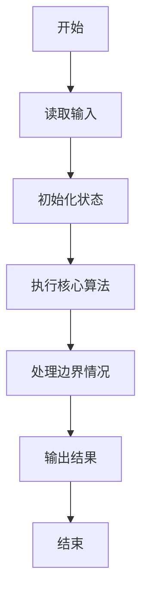
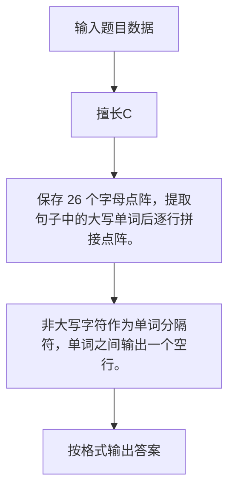

# 1109 擅长C

- **分值：** 20分

### 题目描述

当你被面试官要求用 C 写一个“Hello World”时，有本事像下图显示的那样写一个出来吗？


### 输入格式：

输入首先给出 26 个英文大写字母 A-Z，每个字母用一个 $7\times 5$ 的、由 `C` 和 `.` 组成的矩阵构成。最后在一行中给出一个句子，以回车结束。句子是由若干个单词（每个包含不超过 10 个连续的大写英文字母）组成的，单词间以任何非大写英文字母分隔。

题目保证至少给出一个单词。

### 输出格式：

对每个单词，将其每个字母用矩阵形式在一行中输出，字母间有一列空格分隔。单词的首尾不得有多余空格。

相邻的两个单词间必须有一空行分隔。输出的首尾不得有多余空行。

### 输入样例：
```
..C..
.C.C.
C...C
CCCCC
C...C
C...C
C...C
CCCC.
C...C
C...C
CCCC.
C...C
C...C
CCCC.
.CCC.
C...C
C....
C....
C....
C...C
.CCC.
CCCC.
C...C
C...C
C...C
C...C
C...C
CCCC.
CCCCC
C....
C....
CCCC.
C....
C....
CCCCC
CCCCC
C....
C....
CCCC.
C....
C....
C....
CCCC.
C...C
C....
C.CCC
C...C
C...C
CCCC.
C...C
C...C
C...C
CCCCC
C...C
C...C
C...C
CCCCC
..C..
..C..
..C..
..C..
..C..
CCCCC
CCCCC
....C
....C
....C
....C
C...C
.CCC.
C...C
C..C.
C.C..
CC...
C.C..
C..C.
C...C
C....
C....
C....
C....
C....
C....
CCCCC
C...C
C...C
CC.CC
C.C.C
C...C
C...C
C...C
C...C
C...C
CC..C
C.C.C
C..CC
C...C
C...C
.CCC.
C...C
C...C
C...C
C...C
C...C
.CCC.
CCCC.
C...C
C...C
CCCC.
C....
C....
C....
.CCC.
C...C
C...C
C...C
C.C.C
C..CC
.CCC.
CCCC.
C...C
CCCC.
CC...
C.C..
C..C.
C...C
.CCC.
C...C
C....
.CCC.
....C
C...C
.CCC.
CCCCC
..C..
..C..
..C..
..C..
..C..
..C..
C...C
C...C
C...C
C...C
C...C
C...C
.CCC.
C...C
C...C
C...C
C...C
C...C
.C.C.
..C..
C...C
C...C
C...C
C.C.C
CC.CC
C...C
C...C
C...C
C...C
.C.C.
..C..
.C.C.
C...C
C...C
C...C
C...C
.C.C.
..C..
..C..
..C..
..C..
CCCCC
....C
...C.
..C..
.C...
C....
CCCCC
HELLO~WORLD!
```

### 输出样例：
```
C...C CCCCC C.... C.... .CCC.
C...C C.... C.... C.... C...C
C...C C.... C.... C.... C...C
CCCCC CCCC. C.... C.... C...C
C...C C.... C.... C.... C...C
C...C C.... C.... C.... C...C
C...C CCCCC CCCCC CCCCC .CCC.

C...C .CCC. CCCC. C.... CCCC.
C...C C...C C...C C.... C...C
C...C C...C CCCC. C.... C...C
C.C.C C...C CC... C.... C...C
CC.CC C...C C.C.. C.... C...C
C...C C...C C..C. C.... C...C
C...C .CCC. C...C CCCCC CCCC.
```


### 解题思路

保存 26 个字母点阵，提取句子中的大写单词后逐行拼接点阵。 非大写字符作为单词分隔符，单词之间输出一个空行。

实现时按照题目的输入顺序读取数据，使用与数据规模匹配的数据结构保存必要状态，在遍历或模拟过程中完成核心计算，最后严格按照输出格式生成答案。

### 代码流程说明

1. 读取题目输入，初始化计数器、数组、集合或其他辅助状态。
2. 保存 26 个字母点阵，提取句子中的大写单词后逐行拼接点阵。
3. 非大写字符作为单词分隔符，单词之间输出一个空行。
4. 根据题目要求处理边界情况，并输出最终结果。

时间复杂度为 O(句子长度)，空间复杂度主要取决于输入数据和辅助状态，通常为 O(1) 到 O(n)。

### 代码实现

以下是本题对应的完整 C++17 实现：

```cpp
#include <bits/stdc++.h>
using namespace std;
// 算法原理：保存 26 个字母点阵，提取句子中的大写单词后逐行拼接点阵。
// 关键步骤：非大写字符作为单词分隔符，单词之间输出一个空行。
int main() {
    vector<vector<string>> f(26, vector<string>(7));
    for (int c = 0; c < 26; ++c)
        for (int r = 0; r < 7; ++r)
            cin >> f[c][r];
    string line;
    getline(cin, line);
    getline(cin, line);
    vector<string> w;
    for (int i = 0; i < (int)line.size();) {
        while (i < (int)line.size() && !isupper((unsigned char)line[i]))
            ++i;
        int j = i;
        while (j < (int)line.size() && isupper((unsigned char)line[j]))
            ++j;
        if (j > i)
            w.push_back(line.substr(i, j - i));
        i = j;
    }
    for (int q = 0; q < (int)w.size(); ++q) {
        if (q)
            cout << '\n';
        for (int r = 0; r < 7; ++r) {
            for (int i = 0; i < (int)w[q].size(); ++i) {
                if (i)
                    cout << ' ';
                cout << f[w[q][i] - 'A'][r];
            }
            cout << '\n';
        }
    }
}
```

### 代码流程图



### 解题流程图



### 常见易错点

- 注意输入规模，超大整数、长字符串或链表地址不能简单依赖普通整数和下标。
- 严格区分题目中的边界条件，例如是否包含等号、是否需要保留前导零以及是否只处理完整区块。
- 输出时按照题目规定的空格、换行、大小写和小数位数格式，避免计算正确但格式错误。
