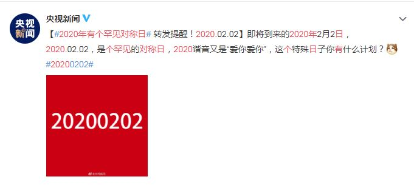
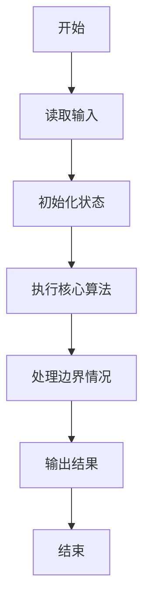
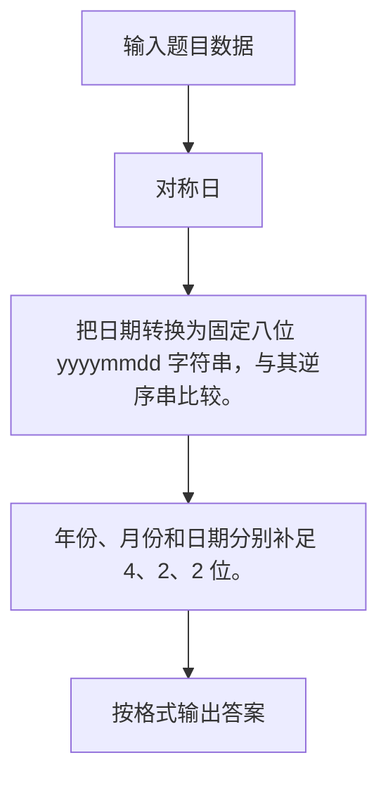

# 1111 对称日

- **分值：** 15分

### 题目描述



央视新闻发了一条微博，指出 2020 年有个罕见的“对称日”，即 2020 年 2 月 2 日，按照 `年年年年月月日日` 格式组成的字符串 20200202 是完全对称的。

给定任意一个日期，本题就请你写程序判断一下，这是不是一个对称日？

### 输入格式：

输入首先在第一行给出正整数 $N$（$1 < N \le 10$）。随后 $N$ 行，每行给出一个日期，却是按英文习惯的格式：`Month Day, Year`。其中 `Month` 是月份的缩写，对应如下：

- 一月：Jan
- 二月：Feb
- 三月：Mar
- 四月：Apr
- 五月：May
- 六月：Jun
- 七月：Jul
- 八月：Aug
- 九月：Sep
- 十月：Oct
- 十一月：Nov
- 十二月：Dec

`Day` 是月份中的日期，为 [1, 31] 区间内的整数；`Year` 是年份，为 [1, 9999] 区间内的整数。

### 输出格式：

对每一个给定的日期，在一行中先输出 `Y` 如果这是一个对称日，否则输出 `N`；随后空一格，输出日期对应的 `年年年年月月日日` 格式组成的字符串。

### 输入样例：
```
5
Feb 2, 2020
Mar 7, 2020
Oct 10, 101
Nov 21, 1211
Dec 29, 1229
```

### 输出样例：
```
Y 20200202
N 20200307
Y 01011010
Y 12111121
N 12291229
```


### 解题思路

把日期转换为固定八位 yyyymmdd 字符串，与其逆序串比较。 年份、月份和日期分别补足 4、2、2 位。

实现时按照题目的输入顺序读取数据，使用与数据规模匹配的数据结构保存必要状态，在遍历或模拟过程中完成核心计算，最后严格按照输出格式生成答案。

### 代码流程说明

1. 读取题目输入，初始化计数器、数组、集合或其他辅助状态。
2. 把日期转换为固定八位 yyyymmdd 字符串，与其逆序串比较。
3. 年份、月份和日期分别补足 4、2、2 位。
4. 根据题目要求处理边界情况，并输出最终结果。

时间复杂度为 O(N)，空间复杂度主要取决于输入数据和辅助状态，通常为 O(1) 到 O(n)。

### 代码实现

以下是本题对应的完整 C++17 实现：

```cpp
#include <bits/stdc++.h>
using namespace std;
// 算法原理：把日期转换为固定八位 yyyymmdd 字符串，与其逆序串比较。
// 关键步骤：年份、月份和日期分别补足 4、2、2 位。
int main() {
    map<string, int> mp;
    string x[] = {"Jan", "Feb", "Mar", "Apr", "May", "Jun",
                  "Jul", "Aug", "Sep", "Oct", "Nov", "Dec"};
    for (int i = 0; i < 12; ++i)
        mp[x[i]] = i + 1;
    int n;
    cin >> n;
    while (n--) {
        string mon, day, year;
        cin >> mon >> day >> year;
        day.pop_back();
        int y = stoi(year), d = stoi(day), mo = mp[mon];
        ostringstream o;
        o << setw(4) << setfill('0') << y << setw(2) << mo << setw(2) << d;
        string s = o.str(), r = s;
        reverse(r.begin(), r.end());
        cout << (s == r ? 'Y' : 'N') << ' ' << s << '\n';
    }
}
```

### 代码流程图



### 解题流程图



### 常见易错点

- 注意输入规模，超大整数、长字符串或链表地址不能简单依赖普通整数和下标。
- 严格区分题目中的边界条件，例如是否包含等号、是否需要保留前导零以及是否只处理完整区块。
- 输出时按照题目规定的空格、换行、大小写和小数位数格式，避免计算正确但格式错误。
