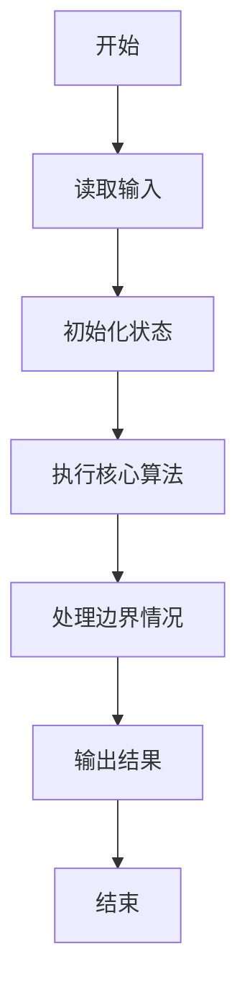
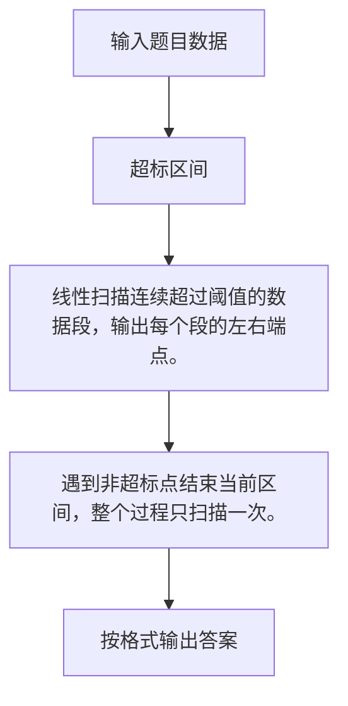

# 1112 超标区间

- **分值：** 20分

### 题目描述


上图是用某科学研究中采集的数据绘制成的折线图，其中红色横线表示正常数据的阈值（在此图中阈值是 25）。你的任务就是把超出阈值的非正常数据所在的区间找出来。例如上图中横轴 [3, 5] 区间中的 3 个数据点超标，横轴上点 9 （可以表示为区间 [9, 9]）对应的数据点也超标。

### 输入格式：

输入第一行给出两个正整数 $N$（$\le 10^4$）和 $T$（$\le 100$），分别是数据点的数量和阈值。第二行给出 $N$ 个数据点的纵坐标，均为不超过 1000 的正整数，对应的横坐标为整数 0 到 $N-1$。

### 输出格式：

按从左到右的顺序输出超标数据的区间，每个区间占一行，格式为 `[A, B]`，其中 `A` 和 `B` 为区间的左右端点。如果没有数据超标，则在一行中输出所有数据的最大值。

### 输入样例：1
```
11 25
21 15 25 28 35 27 20 24 18 32 23
```

### 输出样例：1
```
[3, 5]
[9, 9]
```

### 输入样例：2
```
11 40
21 15 25 28 35 27 20 24 18 32 23
```

### 输出样例：2
```
35
```


### 解题思路

线性扫描连续超过阈值的数据段，输出每个段的左右端点。 遇到非超标点结束当前区间，整个过程只扫描一次。

实现时按照题目的输入顺序读取数据，使用与数据规模匹配的数据结构保存必要状态，在遍历或模拟过程中完成核心计算，最后严格按照输出格式生成答案。

### 代码流程说明

1. 读取题目输入，初始化计数器、数组、集合或其他辅助状态。
2. 线性扫描连续超过阈值的数据段，输出每个段的左右端点。
3. 遇到非超标点结束当前区间，整个过程只扫描一次。
4. 根据题目要求处理边界情况，并输出最终结果。

时间复杂度为 O(N)，空间复杂度主要取决于输入数据和辅助状态，通常为 O(1) 到 O(n)。

### 代码实现

以下是本题对应的完整 C++17 实现：

```cpp
#include <bits/stdc++.h>
using namespace std;
// 算法原理：线性扫描连续超过阈值的数据段，输出每个段的左右端点。
// 关键步骤：遇到非超标点结束当前区间，整个过程只扫描一次。
int main() {
    int n, t;
    cin >> n >> t;
    vector<int> a(n);
    for (int &x : a)
        cin >> x;
    bool any = false;
    for (int i = 0; i < n;) {
        if (a[i] <= t) {
            ++i;
            continue;
        }
        int j = i;
        while (j + 1 < n && a[j + 1] > t)
            ++j;
        cout << '[' << i << ", " << j << "]\n";
        any = true;
        i = j + 1;
    }
    if (!any)
        cout << *max_element(a.begin(), a.end());
}
```

### 代码流程图



### 解题流程图



### 常见易错点

- 注意输入规模，超大整数、长字符串或链表地址不能简单依赖普通整数和下标。
- 严格区分题目中的边界条件，例如是否包含等号、是否需要保留前导零以及是否只处理完整区块。
- 输出时按照题目规定的空格、换行、大小写和小数位数格式，避免计算正确但格式错误。
