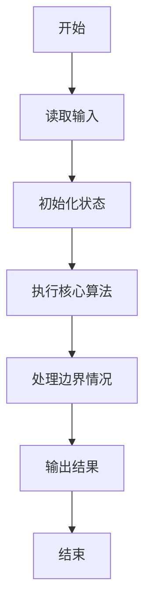
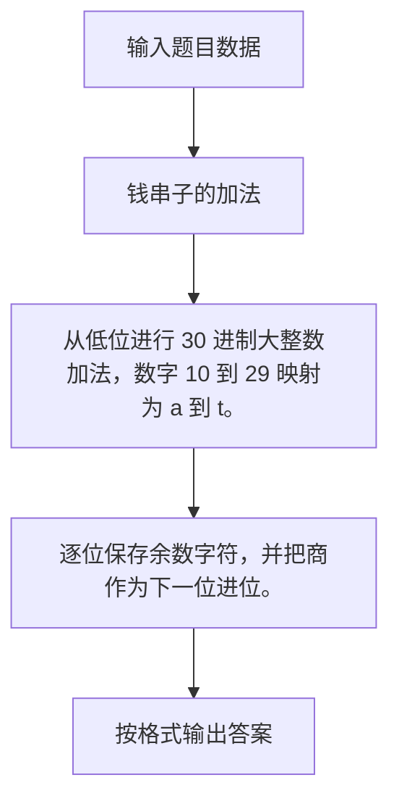

# 1113 钱串子的加法

- **分值：** 20分

### 题目描述


人类习惯用 10 进制，可能因为大多数人类有 10 根手指头，可以用于计数。这个世界上有一种叫“钱串子”（学名“蚰蜒”）的生物，有 30 只细长的手/脚，在它们的世界里，数字应该是 30 进制的。本题就请你实现钱串子世界里的加法运算。

### 输入格式：

输入在一行中给出两个钱串子世界里的非负整数，其间以空格分隔。

所谓“钱串子世界里的整数”是一个 30 进制的数字，其数字 0 到 9 跟人类世界的整数一致，数字 10 到 29 用小写英文字母 a 到 t 顺次表示。

输入给出的两个整数都不超过 $10^5$ 位。

### 输出格式：

在一行中输出两个整数的和。注意结果数字不得有前导零。

### 输入样例：
```
2g50ttaq 0st9hk381
```

### 输出样例：
```
11feik2ir
```


### 解题思路

从低位进行 30 进制大整数加法，数字 10 到 29 映射为 a 到 t。 逐位保存余数字符，并把商作为下一位进位。

实现时按照题目的输入顺序读取数据，使用与数据规模匹配的数据结构保存必要状态，在遍历或模拟过程中完成核心计算，最后严格按照输出格式生成答案。

### 代码流程说明

1. 读取题目输入，初始化计数器、数组、集合或其他辅助状态。
2. 从低位进行 30 进制大整数加法，数字 10 到 29 映射为 a 到 t。
3. 逐位保存余数字符，并把商作为下一位进位。
4. 根据题目要求处理边界情况，并输出最终结果。

时间复杂度为 O(L)，空间复杂度主要取决于输入数据和辅助状态，通常为 O(1) 到 O(n)。

### 代码实现

以下是本题对应的完整 C++17 实现：

```cpp
#include <bits/stdc++.h>
using namespace std;
// 算法原理：从低位进行 30 进制大整数加法，数字 10 到 29 映射为 a 到 t。
// 关键步骤：逐位保存余数字符，并把商作为下一位进位。
int val(char c) { return isdigit((unsigned char)c) ? c - '0' : c - 'a' + 10; }
char enc(int x) { return x < 10 ? '0' + x : 'a' + x - 10; }
int main() {
    string a, b;
    cin >> a >> b;
    int n = max(a.size(), b.size()), carry = 0;
    string r;
    for (int i = 0; i < n; ++i) {
        int x = i < a.size() ? val(a[a.size() - 1 - i]) : 0,
            y = i < b.size() ? val(b[b.size() - 1 - i]) : 0, z = x + y + carry;
        r += enc(z % 30);
        carry = z / 30;
    }
    if (carry)
        r += enc(carry);
    reverse(r.begin(), r.end());
    auto p = r.find_first_not_of('0');
    cout << (p == string::npos ? "0" : r.substr(p));
}
```

### 代码流程图



### 解题流程图



### 常见易错点

- 注意输入规模，超大整数、长字符串或链表地址不能简单依赖普通整数和下标。
- 严格区分题目中的边界条件，例如是否包含等号、是否需要保留前导零以及是否只处理完整区块。
- 输出时按照题目规定的空格、换行、大小写和小数位数格式，避免计算正确但格式错误。
