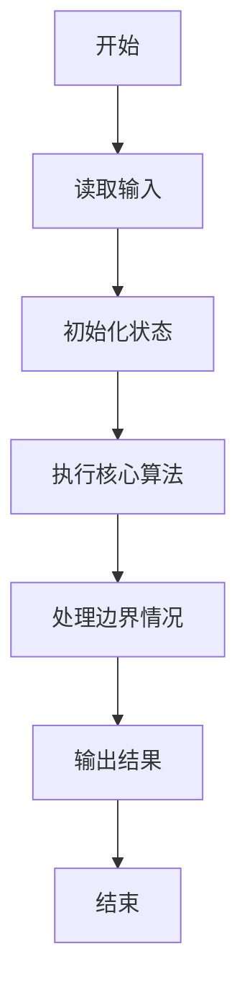
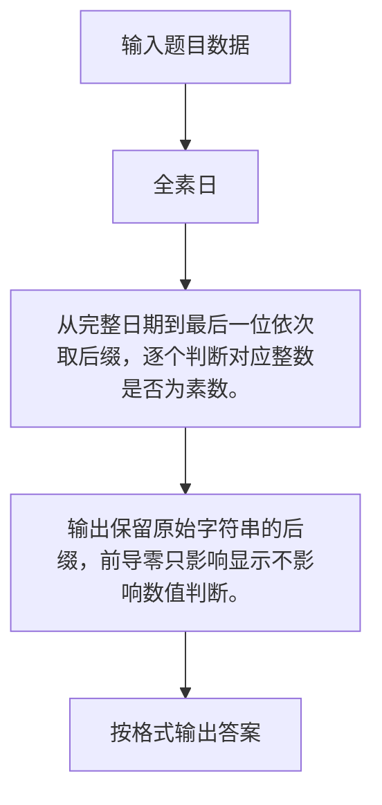

# 1114 全素日

- **分值：** 20分

### 题目描述


以上图片来自新浪微博，展示了一个非常酷的“全素日”：2019年5月23日。即不仅`20190523`本身是个素数，它的任何以末尾数字`3`结尾的子串都是素数。

本题就请你写个程序判断一个给定日期是否是“全素日”。

### 输入格式：

输入按照 `yyyymmdd` 的格式给出一个日期。题目保证日期在0001年1月1日到9999年12月31日之间。

### 输出格式：

从原始日期开始，按照子串长度递减的顺序，每行首先输出一个子串和一个空格，然后输出 `Yes`，如果该子串对应的数字是一个素数，否则输出 `No`。如果这个日期是一个全素日，则在最后一行输出 `All Prime!`。

### 输入样例：1
```
20190523
```

### 输出样例：1
```
20190523 Yes
0190523 Yes
190523 Yes
90523 Yes
0523 Yes
523 Yes
23 Yes
3 Yes
All Prime!
```

### 输入样例：2
```
20191231
```

### 输出样例：2
```
20191231 Yes
0191231 Yes
191231 Yes
91231 No
1231 Yes
231 No
31 Yes
1 No
```


### 解题思路

从完整日期到最后一位依次取后缀，逐个判断对应整数是否为素数。 输出保留原始字符串的后缀，前导零只影响显示不影响数值判断。

实现时按照题目的输入顺序读取数据，使用与数据规模匹配的数据结构保存必要状态，在遍历或模拟过程中完成核心计算，最后严格按照输出格式生成答案。

### 代码流程说明

1. 读取题目输入，初始化计数器、数组、集合或其他辅助状态。
2. 从完整日期到最后一位依次取后缀，逐个判断对应整数是否为素数。
3. 输出保留原始字符串的后缀，前导零只影响显示不影响数值判断。
4. 根据题目要求处理边界情况，并输出最终结果。

时间复杂度为 O(8√V)，空间复杂度主要取决于输入数据和辅助状态，通常为 O(1) 到 O(n)。

### 代码实现

以下是本题对应的完整 C++17 实现：

```cpp
#include <bits/stdc++.h>
using namespace std;
// 算法原理：从完整日期到最后一位依次取后缀，逐个判断对应整数是否为素数。
// 关键步骤：输出保留原始字符串的后缀，前导零只影响显示不影响数值判断。
bool prime(long long x) {
    if (x < 2)
        return false;
    for (long long i = 2; i * i <= x; ++i)
        if (x % i == 0)
            return false;
    return true;
}
int main() {
    string s;
    cin >> s;
    bool all = true;
    for (int len = s.size(); len >= 1; --len) {
        string t = s.substr(s.size() - len);
        bool ok = prime(stoll(t));
        cout << t << ' ' << (ok ? "Yes" : "No") << '\n';
        all &= ok;
    }
    if (all)
        cout << "All Prime!";
}
```

### 代码流程图



### 解题流程图



### 常见易错点

- 注意输入规模，超大整数、长字符串或链表地址不能简单依赖普通整数和下标。
- 严格区分题目中的边界条件，例如是否包含等号、是否需要保留前导零以及是否只处理完整区块。
- 输出时按照题目规定的空格、换行、大小写和小数位数格式，避免计算正确但格式错误。
