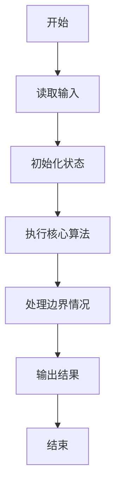
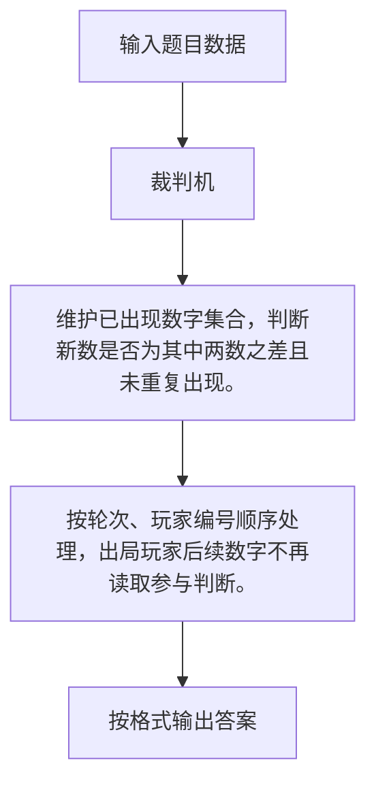

# 1115 裁判机

- **分值：** 25分

### 题目描述

有一种数字游戏的规则如下：首先由裁判给定两个不同的正整数，然后参加游戏的几个人轮流给出正整数。要求给出的数字必须是前面已经出现的某两个正整数之差，且不能等于之前的任何一个数。游戏一直持续若干轮，中间有写重复或写错的人就出局。

本题要求你实现这个游戏的裁判机，自动判断每位游戏者给出的数字是否合法，以及最后的赢家。

### 输入格式：

输入在第一行中给出 2 个初始的正整数，保证都在 $[1, 10^5]$ 范围内且不相同。

第二行依次给出参加比赛的人数 $N$（$2\le N\le 10$）和每个人都要经历的轮次数 $M$（$2\le M\le 10^3$）。

以下 $N$ 行，每行给出 $M$ 个正整数。第 $i$ 行对应第 $i$ 个人给出的数字（$i=1, \cdots , N$）。游戏顺序是从第 1 个人给出第 1 个数字开始，每人顺次在第 1 轮给出自己的第 1 个数字；然后每人顺次在第 2 轮给出自己的第 2 个数字，以此类推。

### 输出格式：

如果在第 `k` 轮，第 `i` 个人出局，就在一行中输出 `Round #k: i is out.`。出局人后面给出的数字不算；同一轮出局的人按编号增序输出。直到最后一轮结束，在一行中输出 `Winner(s): W1 W2 ... Wn`，其中 `W1 ... Wn` 是最后的赢家编号，按增序输出。数字间以 1 个空格分隔，行末不得有多余空格。如果没有赢家，则输出 `No winner.`。

### 输入样例：1
```
101 42
4 5
59 34 67 9 7
17 9 8 50 7
25 92 43 26 37
76 51 1 41 40
```

### 输出样例：1
```
Round #4: 1 is out.
Round #5: 3 is out.
Winner(s): 2 4
```

### 输入样例：2
```
42 101
4 5
59 34 67 9 7
17 9 18 50 49
25 92 58 1 39
102 32 2 6 41
```

### 输出样例：2
```
Round #1: 4 is out.
Round #3: 2 is out.
Round #4: 1 is out.
Round #5: 3 is out.
No winner.
```


### 解题思路

维护已出现数字集合，判断新数是否为其中两数之差且未重复出现。 按轮次、玩家编号顺序处理，出局玩家后续数字不再读取参与判断。

实现时按照题目的输入顺序读取数据，使用与数据规模匹配的数据结构保存必要状态，在遍历或模拟过程中完成核心计算，最后严格按照输出格式生成答案。

### 代码流程说明

1. 读取题目输入，初始化计数器、数组、集合或其他辅助状态。
2. 维护已出现数字集合，判断新数是否为其中两数之差且未重复出现。
3. 按轮次、玩家编号顺序处理，出局玩家后续数字不再读取参与判断。
4. 根据题目要求处理边界情况，并输出最终结果。

时间复杂度为 O(M·D²)，空间复杂度主要取决于输入数据和辅助状态，通常为 O(1) 到 O(n)。

### 代码实现

以下是本题对应的完整 C++17 实现：

```cpp
#include <bits/stdc++.h>
using namespace std;
// 算法原理：维护已出现数字集合，判断新数是否为其中两数之差且未重复出现。
// 关键步骤：按轮次、玩家编号顺序处理，出局玩家后续数字不再读取参与判断。
int main() {
    int x, y, n, m;
    cin >> x >> y >> n >> m;
    vector<vector<int>> a(n, vector<int>(m));
    for (auto &r : a)
        for (int &z : r)
            cin >> z;
    set<int> seen = {x, y};
    vector<bool> alive(n, true);
    for (int r = 0; r < m; ++r) {
        vector<int> out;
        for (int i = 0; i < n; ++i)
            if (alive[i]) {
                int z = a[i][r];
                bool possible = false;
                for (int u : seen)
                    for (int v : seen)
                        if (u != v && abs(u - v) == z)
                            possible = true;
                if (seen.count(z) || !possible)
                    alive[i] = false, out.push_back(i + 1);
                else
                    seen.insert(z);
            }
        for (int i : out)
            cout << "Round #" << r + 1 << ": " << i << " is out.\n";
    }
    vector<int> w;
    for (int i = 0; i < n; ++i)
        if (alive[i])
            w.push_back(i + 1);
    if (w.empty())
        cout << "No winner.";
    else {
        cout << "Winner(s):";
        for (int i : w)
            cout << ' ' << i;
    }
}
```

### 代码流程图



### 解题流程图



### 常见易错点

- 注意输入规模，超大整数、长字符串或链表地址不能简单依赖普通整数和下标。
- 严格区分题目中的边界条件，例如是否包含等号、是否需要保留前导零以及是否只处理完整区块。
- 输出时按照题目规定的空格、换行、大小写和小数位数格式，避免计算正确但格式错误。
