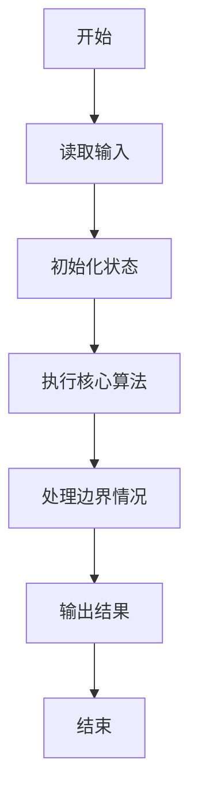
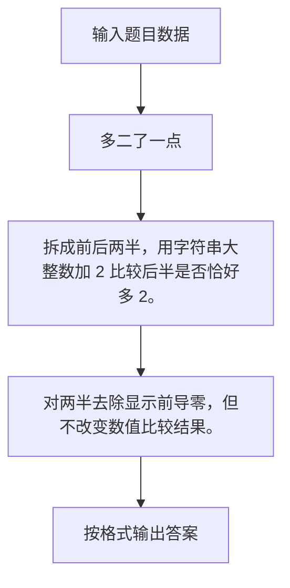

# 1116 多二了一点

- **分值：** 15分

### 题目描述

若一个正整数有 $2n$ 个数位，后 $n$ 个数位组成的数恰好比前 $n$ 个数位组成的数多 2，则称这个数字“多二了一点”。如 24、6668、233235 等都是多二了一点的数字。
给定任一正整数，请你判断它有没有多二了那么一点。

### 输入格式：
输入在第一行中给出一个正整数 $N$（$\le 10^{1000}$）。

### 输出格式：
在一行中根据情况输出下列之一：
- 如果输入的整数没有偶数个数位，输出 `Error: X digit(s)`，其中 `X` 是 $N$ 的位数；
- 如果是偶数位的数字，并且是多二了一点，输出 `Yes: X - Y = 2`，其中 `X` 是后一半数位组成的数，`Y` 是前一半数位组成的数。**注意：为了让题目简单，输入保证此时 `Y` 的个位数不大于 7。**
- 如果是偶数位的数字，但并不是多二了一点，输出 `No: X - Y != 2`，其中 `X` 是后一半数位组成的数，`Y` 是前一半数位组成的数。

### 输入样例：1
```
233235
```
### 输出样例：1
```
Yes: 235 - 233 = 2
```
### 输入样例：2
```
5678912345
```
### 输出样例：2
```
No: 12345 - 56789 != 2
```
### 输入样例：3
```
2331235
```
### 输出样例：3
```
Error: 7 digit(s)
```

**鸣谢彭诗扬修正数据！**


### 解题思路

拆成前后两半，用字符串大整数加 2 比较后半是否恰好多 2。 对两半去除显示前导零，但不改变数值比较结果。

实现时按照题目的输入顺序读取数据，使用与数据规模匹配的数据结构保存必要状态，在遍历或模拟过程中完成核心计算，最后严格按照输出格式生成答案。

### 代码流程说明

1. 读取题目输入，初始化计数器、数组、集合或其他辅助状态。
2. 拆成前后两半，用字符串大整数加 2 比较后半是否恰好多 2。
3. 对两半去除显示前导零，但不改变数值比较结果。
4. 根据题目要求处理边界情况，并输出最终结果。

时间复杂度为 O(L)，空间复杂度主要取决于输入数据和辅助状态，通常为 O(1) 到 O(n)。

### 代码实现

以下是本题对应的完整 C++17 实现：

```cpp
#include <bits/stdc++.h>
using namespace std;
// 算法原理：拆成前后两半，用字符串大整数加 2 比较后半是否恰好多 2。
// 关键步骤：对两半去除显示前导零，但不改变数值比较结果。
string norm(string s) {
    auto p = s.find_first_not_of('0');
    return p == string::npos ? "0" : s.substr(p);
}
string plus2(string s) {
    s = norm(s);
    int c = 2;
    for (int i = s.size() - 1; i >= 0 && c; --i) {
        int z = s[i] - '0' + c;
        s[i] = '0' + z % 10;
        c = z / 10;
    }
    if (c)
        s = '1' + s;
    return s;
}
int main() {
    string s;
    cin >> s;
    if (s.size() % 2) {
        cout << "Error: " << s.size() << " digit(s)";
        return 0;
    }
    int k = s.size() / 2;
    string y = norm(s.substr(0, k)), x = norm(s.substr(k));
    bool ok = x == plus2(y);
    cout << (ok ? "Yes: " : "No: ") << x << " - " << y << (ok ? " = 2" : " != 2");
}
```

### 代码流程图



### 解题流程图



### 常见易错点

- 注意输入规模，超大整数、长字符串或链表地址不能简单依赖普通整数和下标。
- 严格区分题目中的边界条件，例如是否包含等号、是否需要保留前导零以及是否只处理完整区块。
- 输出时按照题目规定的空格、换行、大小写和小数位数格式，避免计算正确但格式错误。
