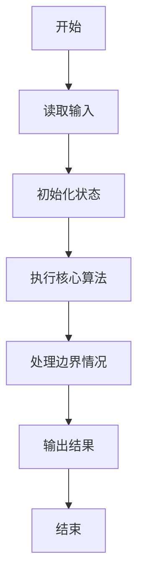
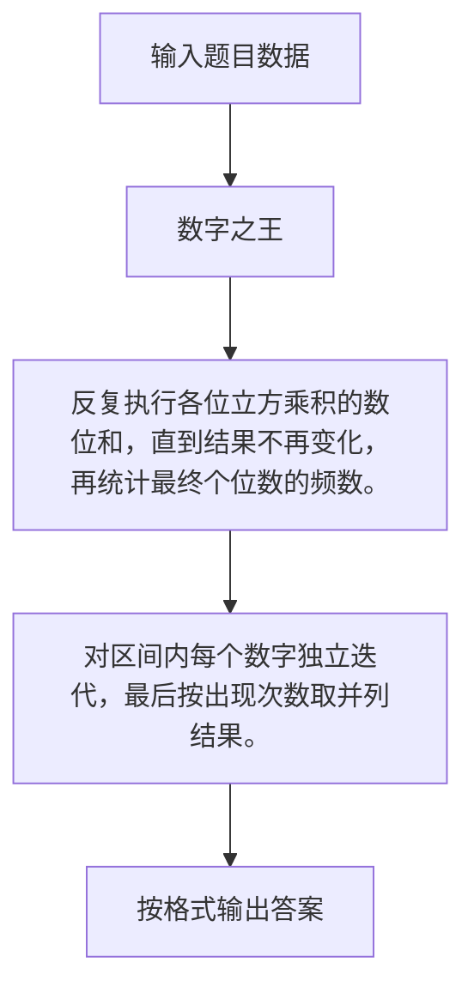

# 1117 数字之王

- **分值：** 20分

### 题目描述

给定两个正整数 $N_1 < N_2$。把从 $N_1$ 到 $N_2$ 的每个数的各位数的立方相乘，再将结果的各位数求和，得到一批新的数字，再对这批新的数字重复上述操作，直到所有数字都是 1 位数为止。这时哪个数字最多，哪个就是“数字之王”。

例如 $N_1=1$ 和 $N_2=10$ 时，第一轮操作后得到 { 1, 8, 9, 10, 8, 9, 10, 8, 18, 0 }；第二轮操作后得到 { 1, 8, 18, 0, 8, 18, 0, 8, 8, 0 }；第三轮操作后得到 { 1, 8, 8, 0, 8, 8, 0, 8, 8, 0 }。所以数字之王就是 8。

本题就请你对任意给定的 $N_1 < N_2$ 求出对应的数字之王。

### 输入格式：

输入在第一行中给出两个正整数 $0<N_1 < N_2 \le 10^3$，其间以空格分隔。

### 输出格式：

首先在一行中输出数字之王的出现次数，随后第二行输出数字之王。例如对输入 `1 10` 就应该在两行中先后输出 `6` 和 `8`。如果有并列的数字之王，则按递增序输出。数字间以 1 个空格分隔，行首尾不得有多余空格。

### 输入样例：
```
10 14
```

### 输出样例：
```
2
0 8
```


### 解题思路

反复执行各位立方乘积的数位和，直到结果不再变化，再统计最终个位数的频数。 对区间内每个数字独立迭代，最后按出现次数取并列结果。

实现时按照题目的输入顺序读取数据，使用与数据规模匹配的数据结构保存必要状态，在遍历或模拟过程中完成核心计算，最后严格按照输出格式生成答案。

### 代码流程说明

1. 读取题目输入，初始化计数器、数组、集合或其他辅助状态。
2. 反复执行各位立方乘积的数位和，直到结果不再变化，再统计最终个位数的频数。
3. 对区间内每个数字独立迭代，最后按出现次数取并列结果。
4. 根据题目要求处理边界情况，并输出最终结果。

时间复杂度为 O((N₂-N₁)·L)，空间复杂度主要取决于输入数据和辅助状态，通常为 O(1) 到 O(n)。

### 代码实现

以下是本题对应的完整 C++17 实现：

```cpp
#include <bits/stdc++.h>
using namespace std;
// 算法原理：反复执行各位立方乘积的数位和，直到结果不再变化，再统计最终个位数的频数。
// 关键步骤：对区间内每个数字独立迭代，最后按出现次数取并列结果。
long long f(long long x) {
    vector<int> product(1, 1);
    if (!x)
        return 0;
    while (x) {
        int d = x % 10;
        x /= 10;
        int factor = d * d * d;
        int carry = 0;
        for (int &digit : product) {
            int value = digit * factor + carry;
            digit = value % 10;
            carry = value / 10;
        }
        while (carry) {
            product.push_back(carry % 10);
            carry /= 10;
        }
    }
    int s = 0;
    for (int digit : product)
        s += digit;
    return s;
}
int main() {
    int a, b;
    cin >> a >> b;
    int c[10] = {};
    for (int x = a; x <= b; ++x) {
        long long y = x;
        while (true) {
            long long next = f(y);
            if (next == y)
                break;
            y = next;
        }
        ++c[y];
    }
    int mx = *max_element(c, c + 10);
    cout << mx << '\n';
    bool first = true;
    for (int i = 0; i < 10; ++i)
        if (c[i] == mx) {
            if (!first)
                cout << ' ';
            cout << i;
            first = false;
        }
}
```

### 代码流程图



### 解题流程图



### 常见易错点

- 注意输入规模，超大整数、长字符串或链表地址不能简单依赖普通整数和下标。
- 严格区分题目中的边界条件，例如是否包含等号、是否需要保留前导零以及是否只处理完整区块。
- 输出时按照题目规定的空格、换行、大小写和小数位数格式，避免计算正确但格式错误。
