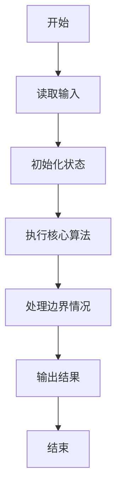
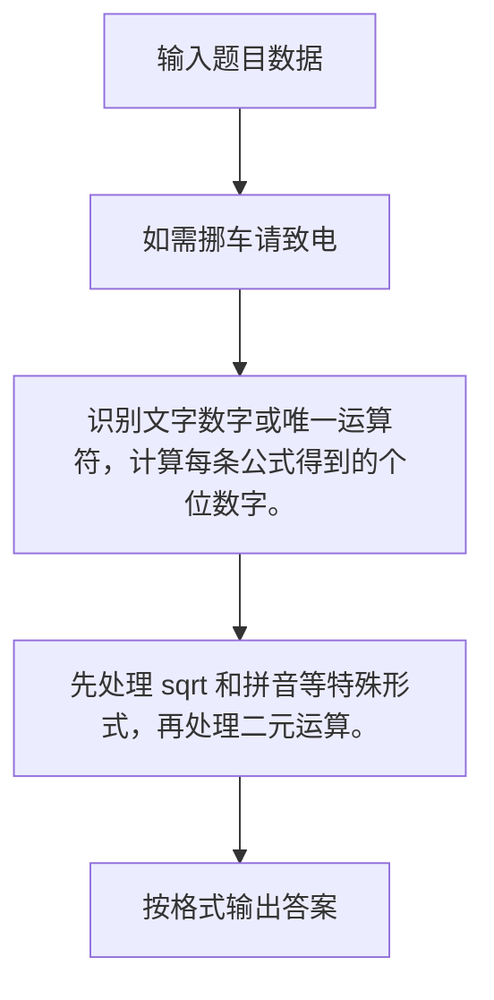

# 1118 如需挪车请致电

- **分值：** 20分

### 题目描述


上图转自新浪微博。车主用一系列简单计算给出了自己的电话号码，即：

$2/2=1$、$3+2=5$、$\sqrt {9} = 3$、$\sqrt {9} = 3$、$0\% = 0$、叁$=3$、$5-2=3$、$9/3=3$、$1\times 3 = 3$、$2^3 = 8$、$8/2=4$，最后得到的电话号码就是 153 3033 3384。

本题就请你写个程序自动完成电话号码的转换，以帮助那些不会计算的人。

### 输入格式：

输入用 11 行依次给出 11 位数字的计算公式，每个公式占一行。这里仅考虑以下几种运算：加（`+`）、减（`-`）、乘（`*`）、除（`/`）、取余（`%`，注意这不是上图中的百分比）、开平方根号（`sqrt`）、指数（`^`）和文字（即 0 到 9 的全小写汉语拼音，如 `ling` 表示 0）。运算符与运算数之间无空格，运算数保证是不超过 1000 的非负整数。题目保证每个计算至多只有 1 个运算符，结果都是 1 位整数。

### 输出格式：

在一行中给出电话号码，数字间不要空格。

### 输入样例：
```
2/2
3+2
sqrt9
sqrt9
6%2
san
5-2
9/3
1*3
2^3
8/2
```

### 输出样例：
```
15330333384
```


### 解题思路

识别文字数字或唯一运算符，计算每条公式得到的个位数字。 先处理 sqrt 和拼音等特殊形式，再处理二元运算。

实现时按照题目的输入顺序读取数据，使用与数据规模匹配的数据结构保存必要状态，在遍历或模拟过程中完成核心计算，最后严格按照输出格式生成答案。

### 代码流程说明

1. 读取题目输入，初始化计数器、数组、集合或其他辅助状态。
2. 识别文字数字或唯一运算符，计算每条公式得到的个位数字。
3. 先处理 sqrt 和拼音等特殊形式，再处理二元运算。
4. 根据题目要求处理边界情况，并输出最终结果。

时间复杂度为 O(1)，空间复杂度主要取决于输入数据和辅助状态，通常为 O(1) 到 O(n)。

### 代码实现

以下是本题对应的完整 C++17 实现：

```cpp
#include <bits/stdc++.h>
using namespace std;
// 算法原理：识别文字数字或唯一运算符，计算每条公式得到的个位数字。
// 关键步骤：先处理 sqrt 和拼音等特殊形式，再处理二元运算。
int main() {
    map<string, int> v{{"ling", 0}, {"yi", 1},  {"er", 2}, {"san", 3}, {"si", 4},
                       {"wu", 5},   {"liu", 6}, {"qi", 7}, {"ba", 8},  {"jiu", 9}};
    for (int i = 0; i < 11; ++i) {
        string s;
        cin >> s;
        size_t p = s.find("sqrt");
        int ans = 0;
        if (p == 0)
            ans = sqrt(stoi(s.substr(4)));
        else if (v.count(s))
            ans = v[s];
        else {
            char op;
            for (char c : s)
                if (string("+-*/%^ ").find(c) != string::npos) {
                    op = c;
                    break;
                }
            p = s.find(op);
            int a = stoi(s.substr(0, p)), b = stoi(s.substr(p + 1));
            if (op == '+')
                ans = a + b;
            if (op == '-')
                ans = a - b;
            if (op == '*')
                ans = a * b;
            if (op == '/')
                ans = a / b;
            if (op == '%')
                ans = a % b;
            if (op == '^')
                ans = pow(a, b);
        }
        cout << ans;
    }
}
```

### 代码流程图



### 解题流程图



### 常见易错点

- 注意输入规模，超大整数、长字符串或链表地址不能简单依赖普通整数和下标。
- 严格区分题目中的边界条件，例如是否包含等号、是否需要保留前导零以及是否只处理完整区块。
- 输出时按照题目规定的空格、换行、大小写和小数位数格式，避免计算正确但格式错误。
