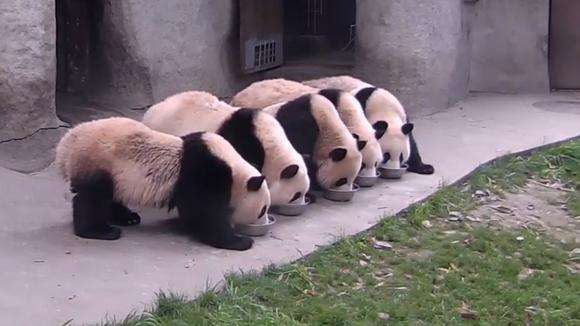
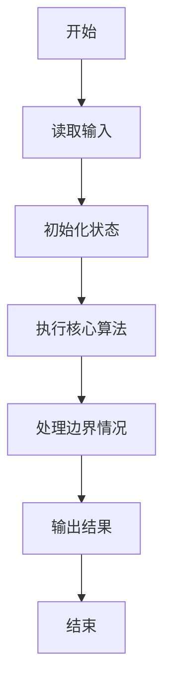
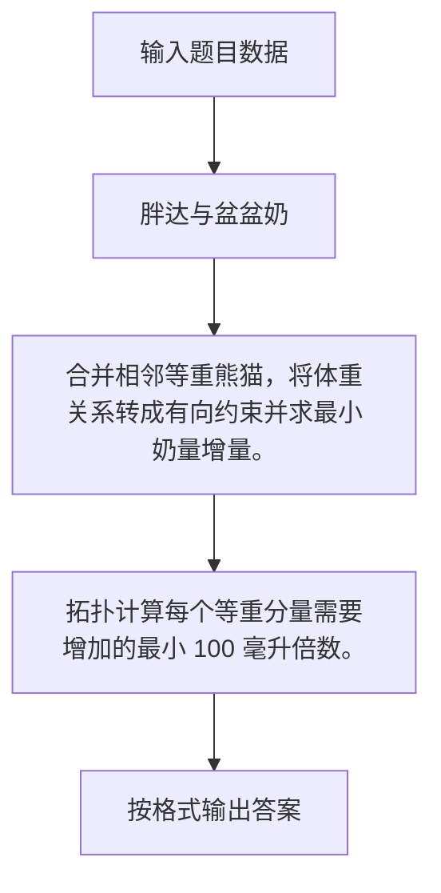

# 1119 胖达与盆盆奶

- **分值：** 20分

### 题目描述



大熊猫，俗称“胖达”，会排队吃盆盆奶。它们能和谐吃奶的前提，是它们认为盆盆奶的分配是“公平”的，即：更胖的胖达能吃到更多的奶，等胖的胖达得吃到一样多的奶。另一方面，因为它们是排好队的，所以每只胖达只能看到身边胖达的奶有多少，如果觉得不公平就会抢旁边小伙伴的奶吃。

已知一只胖达每次最少要吃 200 毫升的奶，当另一份盆盆奶多出至少 100 毫升的时候，它们才能感觉到是“更多”了，否则没感觉。

现在给定一排胖达的体重，请你帮饲养员计算一下，在保持给定队形的前提下，至少应该准备多少毫升的盆盆奶？

### 输入格式：

输入首先在第一行给出正整数 $n$（$\le 10^4$），为胖达的个数。随后一行给出 $n$ 个正整数，表示 $n$ 只胖达的体重（公斤）。每个数值是不超过 200 的正整数，数字间以空格分隔。

### 输出格式：

在一行中输出至少应该准备多少毫升的盆盆奶。

### 输入样例：
```
10
180 160 100 150 145 142 138 138 138 140
```

### 输出样例：
```
3000
```

### 样例解释

盆盆奶的分配量顺序为：

```
400 300 200 500 400 300 200 200 200 300
```


### 解题思路

合并相邻等重熊猫，将体重关系转成有向约束并求最小奶量增量。 拓扑计算每个等重分量需要增加的最小 100 毫升倍数。

实现时按照题目的输入顺序读取数据，使用与数据规模匹配的数据结构保存必要状态，在遍历或模拟过程中完成核心计算，最后严格按照输出格式生成答案。

### 代码流程说明

1. 读取题目输入，初始化计数器、数组、集合或其他辅助状态。
2. 合并相邻等重熊猫，将体重关系转成有向约束并求最小奶量增量。
3. 拓扑计算每个等重分量需要增加的最小 100 毫升倍数。
4. 根据题目要求处理边界情况，并输出最终结果。

时间复杂度为 O(n)，空间复杂度主要取决于输入数据和辅助状态，通常为 O(1) 到 O(n)。

### 代码实现

以下是本题对应的完整 C++17 实现：

```cpp
#include <bits/stdc++.h>
using namespace std;
// 算法原理：合并相邻等重熊猫，将体重关系转成有向约束并求最小奶量增量。
// 关键步骤：拓扑计算每个等重分量需要增加的最小 100 毫升倍数。
struct DSU {
    vector<int> p;
    DSU(int n) : p(n) { iota(p.begin(), p.end(), 0); }
    int f(int x) { return p[x] == x ? x : p[x] = f(p[x]); }
    void u(int a, int b) {
        a = f(a);
        b = f(b);
        if (a != b)
            p[b] = a;
    }
};
int main() {
    int n;
    cin >> n;
    vector<int> w(n), a(n, 200);
    for (int &x : w)
        cin >> x;
    DSU d(n);
    for (int i = 1; i < n; ++i)
        if (w[i] == w[i - 1])
            d.u(i, i - 1);
    int q = 0;
    for (int i = 0; i < n; ++i)
        if (d.f(i) == i)
            q++;
    vector<int> root(q), idx(n, -1), weight;
    for (int i = 0, j = 0; i < n; ++i)
        if (d.f(i) == i)
            idx[i] = j++, weight.push_back(w[i]);
    for (int i = 0; i < n; ++i)
        idx[i] = idx[d.f(i)];
    vector<vector<pair<int, int>>> g(q);
    vector<int> ind(q);
    for (int i = 1; i < n; ++i)
        if (idx[i] != idx[i - 1]) {
            int u = idx[i - 1], v = idx[i];
            if (w[i - 1] > w[i])
                swap(u, v);
            g[u].push_back({v, 100});
            ++ind[v];
        }
    queue<int> qu;
    vector<int> dist(q, 0);
    for (int i = 0; i < q; ++i)
        if (!ind[i])
            qu.push(i);
    while (!qu.empty()) {
        int u = qu.front();
        qu.pop();
        for (auto [v, z] : g[u])
            dist[v] = max(dist[v], dist[u] + z), --ind[v] == 0 ? qu.push(v) : void();
    }
    long long sum = 0;
    for (int i = 0; i < n; ++i)
        sum += 200 + dist[idx[i]];
    cout << sum;
}
```

### 代码流程图



### 解题流程图



### 常见易错点

- 注意输入规模，超大整数、长字符串或链表地址不能简单依赖普通整数和下标。
- 严格区分题目中的边界条件，例如是否包含等号、是否需要保留前导零以及是否只处理完整区块。
- 输出时按照题目规定的空格、换行、大小写和小数位数格式，避免计算正确但格式错误。
