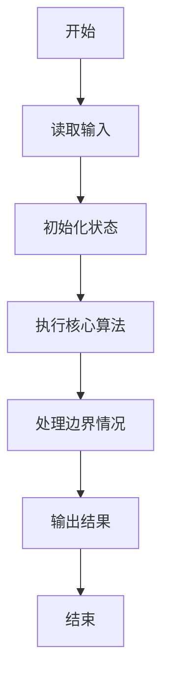
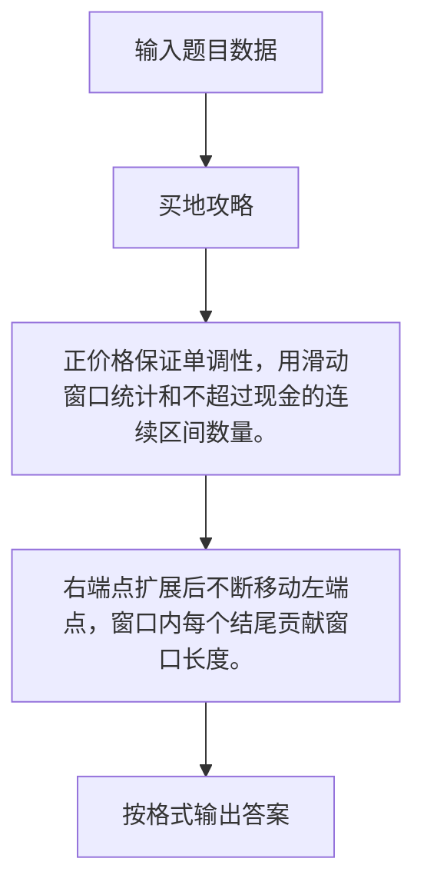

# 1120 买地攻略

- **分值：** 25分

### 题目描述

数码城市有土地出售。待售的土地被划分成若干块，每一块标有一个价格。这里假设每块土地只有两块相邻的土地，除了开头和结尾的两块是只有一块邻居的。每位客户可以购买多块连续相邻的土地。

现给定这一系列土地的标价，请你编写程序，根据客户手头的现金量，告诉客户有多少种不同的购买方案。

### 输入格式：

输入首先在第一行给出两个正整数：$N$（$\le 10^4$）为土地分割的块数（于是这些块从 1 到 $N$ 顺次编号）；$M$（$\le 10^9$）为客户手中的现金量。

随后一行给出 $N$ 个正整数，其中第 $i$ 个数字就是第 $i$ 块土地的标价。

题目保证所有土地的总价不超过 $10^9$。

### 输出格式：

在一行中输出客户有多少种不同的购买方案。请注意客户只能购买连续相邻的土地。

### 输入样例：
```
5 85
38 42 15 24 9
```

### 输出样例：
```
11
```

### 样例解释

这 11 种不同的方案为：

```
38
42
15
24
9
38 42
42 15
42 15 24
15 24
15 24 9
24 9
```


### 解题思路

正价格保证单调性，用滑动窗口统计和不超过现金的连续区间数量。 右端点扩展后不断移动左端点，窗口内每个结尾贡献窗口长度。

实现时按照题目的输入顺序读取数据，使用与数据规模匹配的数据结构保存必要状态，在遍历或模拟过程中完成核心计算，最后严格按照输出格式生成答案。

### 代码流程说明

1. 读取题目输入，初始化计数器、数组、集合或其他辅助状态。
2. 正价格保证单调性，用滑动窗口统计和不超过现金的连续区间数量。
3. 右端点扩展后不断移动左端点，窗口内每个结尾贡献窗口长度。
4. 根据题目要求处理边界情况，并输出最终结果。

时间复杂度为 O(N)，空间复杂度主要取决于输入数据和辅助状态，通常为 O(1) 到 O(n)。

### 代码实现

以下是本题对应的完整 C++17 实现：

```cpp
#include <bits/stdc++.h>
using namespace std;
// 算法原理：正价格保证单调性，用滑动窗口统计和不超过现金的连续区间数量。
// 关键步骤：右端点扩展后不断移动左端点，窗口内每个结尾贡献窗口长度。
int main() {
    int n;
    long long m;
    cin >> n >> m;
    vector<long long> a(n);
    for (auto &x : a)
        cin >> x;
    long long sum = 0, ans = 0;
    int l = 0;
    for (int r = 0; r < n; ++r) {
        sum += a[r];
        while (sum > m && l <= r)
            sum -= a[l++];
        ans += r - l + 1;
    }
    cout << ans;
}
```

### 代码流程图



### 解题流程图



### 常见易错点

- 注意输入规模，超大整数、长字符串或链表地址不能简单依赖普通整数和下标。
- 严格区分题目中的边界条件，例如是否包含等号、是否需要保留前导零以及是否只处理完整区块。
- 输出时按照题目规定的空格、换行、大小写和小数位数格式，避免计算正确但格式错误。
