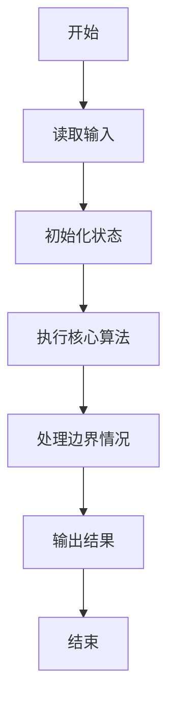
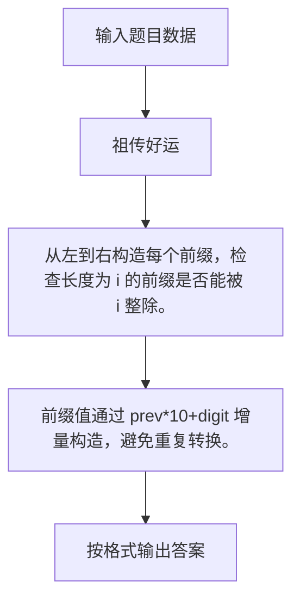

# 1121 祖传好运

- **分值：** 15分

### 题目描述

我们首先定义 0 到 9 都是**好运数**，然后从某个好运数开始，持续在其右边添加数字，形成新的数字。我们称一个大于 9 的数字 $N$ 具有**祖传好运**，如果它是由某个好运数添加了一个个位数字得到的，并且它能被自己的位数整除。

例如 123 就是一个祖传好运数。首先因为 1 是一个好运数的老祖宗，添加了 2 以后，形成的 12 能被其位数 2 （即 12 是一个 2 位数）整除，所以 12 是一个祖传好运数；在 12 后面添加了 3 以后，形成的 123 能被其位数 3 整除，所以 123 是一个祖传好运数。

本题就请你判断一个给定的正整数 $N$ 是不是具有祖传的好运。

### 输入格式：

每个输入包含 1 个测试用例。每个测试用例第 1 行给出正整数 $K$ ($\le 1000$)；第 2 行给出 $K$ 个不超过 $10^9$ 的待评测的正整数，注意这些数字都保证没有多余的前导零。

### 输出格式：

对每个待评测的数字，在一行中输出 `Yes` 如果它是一个祖传好运数，如果不是则输出 `No`。

### 输入样例：
```
5
123 7 43 2333 56160
```

### 输出样例：
```
Yes
Yes
No
No
Yes
```


### 解题思路

从左到右构造每个前缀，检查长度为 i 的前缀是否能被 i 整除。 前缀值通过 prev*10+digit 增量构造，避免重复转换。

实现时按照题目的输入顺序读取数据，使用与数据规模匹配的数据结构保存必要状态，在遍历或模拟过程中完成核心计算，最后严格按照输出格式生成答案。

### 代码流程说明

1. 读取题目输入，初始化计数器、数组、集合或其他辅助状态。
2. 从左到右构造每个前缀，检查长度为 i 的前缀是否能被 i 整除。
3. 前缀值通过 prev*10+digit 增量构造，避免重复转换。
4. 根据题目要求处理边界情况，并输出最终结果。

时间复杂度为 O(K·L)，空间复杂度主要取决于输入数据和辅助状态，通常为 O(1) 到 O(n)。

### 代码实现

以下是本题对应的完整 C++17 实现：

```cpp
#include <bits/stdc++.h>
using namespace std;
// 算法原理：从左到右构造每个前缀，检查长度为 i 的前缀是否能被 i 整除。
// 关键步骤：前缀值通过 prev*10+digit 增量构造，避免重复转换。
int main() {
    int n;
    cin >> n;
    while (n--) {
        long long x;
        cin >> x;
        string s = to_string(x);
        bool ok = true;
        long long p = 0;
        for (int i = 0; i < (int)s.size() && ok; ++i) {
            p = p * 10 + s[i] - '0';
            if (i && p % (i + 1))
                ok = false;
        }
        cout << (ok ? "Yes" : "No") << '\n';
    }
}
```

### 代码流程图



### 解题流程图



### 常见易错点

- 注意输入规模，超大整数、长字符串或链表地址不能简单依赖普通整数和下标。
- 严格区分题目中的边界条件，例如是否包含等号、是否需要保留前导零以及是否只处理完整区块。
- 输出时按照题目规定的空格、换行、大小写和小数位数格式，避免计算正确但格式错误。
