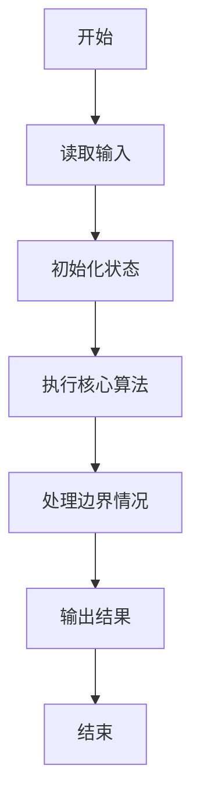
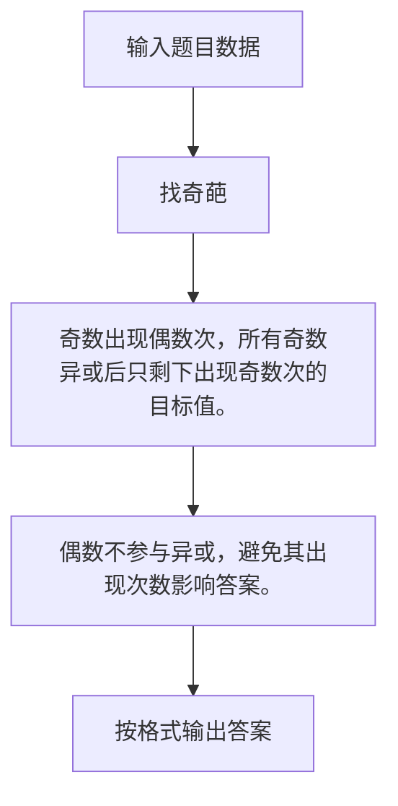

# 1122 找奇葩

- **分值：** 20分

### 题目描述

在一个长度为 $n$ 的正整数序列中，所有的奇数都出现了偶数次，只有一个奇葩奇数出现了奇数次。你的任务就是找出这个奇葩。

### 输入格式：

输入首先在第一行给出一个正整数 $n$（$\le 10^4$），随后一行给出 $n$ 个满足题面描述的正整数。每个数值不超过 $10^5$，数字间以空格分隔。

### 输出格式：

在一行中输出那个奇葩数。题目保证这个奇葩是存在的。

### 输入样例：
```
12
23 16 87 233 87 16 87 233 23 87 233 16
```

### 输出样例：
```
233
```


### 解题思路

奇数出现偶数次，所有奇数异或后只剩下出现奇数次的目标值。 偶数不参与异或，避免其出现次数影响答案。

实现时按照题目的输入顺序读取数据，使用与数据规模匹配的数据结构保存必要状态，在遍历或模拟过程中完成核心计算，最后严格按照输出格式生成答案。

### 代码流程说明

1. 读取题目输入，初始化计数器、数组、集合或其他辅助状态。
2. 奇数出现偶数次，所有奇数异或后只剩下出现奇数次的目标值。
3. 偶数不参与异或，避免其出现次数影响答案。
4. 根据题目要求处理边界情况，并输出最终结果。

时间复杂度为 O(N)，空间复杂度主要取决于输入数据和辅助状态，通常为 O(1) 到 O(n)。

### 代码实现

以下是本题对应的完整 C++17 实现：

```cpp
#include <bits/stdc++.h>
using namespace std;
// 算法原理：奇数出现偶数次，所有奇数异或后只剩下出现奇数次的目标值。
// 关键步骤：偶数不参与异或，避免其出现次数影响答案。
int main() {
    int n;
    cin >> n;
    int ans = 0;
    while (n--) {
        int x;
        cin >> x;
        if (x % 2)
            ans ^= x;
    }
    cout << ans;
}
```

### 代码流程图



### 解题流程图



### 常见易错点

- 注意输入规模，超大整数、长字符串或链表地址不能简单依赖普通整数和下标。
- 严格区分题目中的边界条件，例如是否包含等号、是否需要保留前导零以及是否只处理完整区块。
- 输出时按照题目规定的空格、换行、大小写和小数位数格式，避免计算正确但格式错误。
