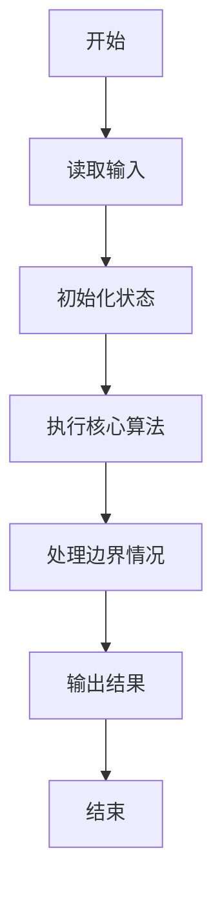
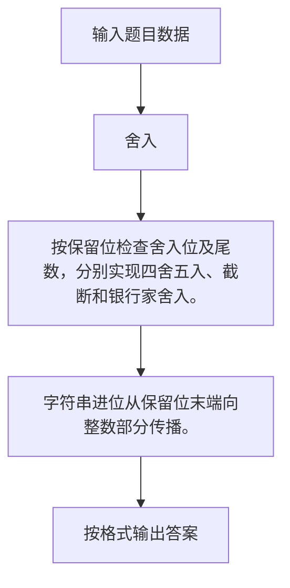

# 1123 舍入

- **分值：** 20分

### 题目描述

不同的编译器对浮点数的精度有不同的处理方法。常见的一种是“四舍五入”，即考察指定有效位的后一位数字，如果不小于 5，就令有效位最后一位进位，然后舍去后面的尾数；如果小于 5 就直接舍去尾数。另一种叫“截断”，即不管有效位后面是什么数字，一概直接舍去。还有一种是“四舍六入五成双”，即当有效位的后一位数字是 5 时，有 3 种情况要考虑：如果 5 后面还有其它非 0 尾数，则进位；如果没有，则当有效位最后一位是单数时进位，双数时舍去，即保持最后一位是双数。

本题就请你写程序按照要求处理给定浮点数的舍入问题。

### 输入格式：

输入第一行给出两个不超过 100 的正整数 $N$ 和 $D$，分别是待处理数字的个数和要求保留的小数点后的有效位数。随后 $N$ 行，每行给出一个待处理数字的信息，格式如下：

```
指令符 数字
```

其中`指令符`是表示舍入方法的一位数字，`1` 表示“四舍五入”，`2` 表示“截断”，`3` 表示“四舍六入五成双”；`数字`是一个总长度不超过 200 位的浮点数，且不以小数点开头或结尾，即 `0.123` 不会写成 `.123`，`123` 也不会写成 `123.`。此外，输入保证没有不必要的正负号（例如 `-0.0` 或 `+1`）。

### 输出格式：

对每个待处理数字，在一行中输出根据指令符处理后的结果数字。

### 输入样例：
```
7 3
1 3.1415926
2 3.1415926
3 3.1415926
3 3.14150
3 3.14250
3 3.14251
1 3.14
```

### 输出样例：
```
3.142
3.141
3.142
3.142
3.142
3.143
3.140
```


### 解题思路

按保留位检查舍入位及尾数，分别实现四舍五入、截断和银行家舍入。 字符串进位从保留位末端向整数部分传播。

实现时按照题目的输入顺序读取数据，使用与数据规模匹配的数据结构保存必要状态，在遍历或模拟过程中完成核心计算，最后严格按照输出格式生成答案。

### 代码流程说明

1. 读取题目输入，初始化计数器、数组、集合或其他辅助状态。
2. 按保留位检查舍入位及尾数，分别实现四舍五入、截断和银行家舍入。
3. 字符串进位从保留位末端向整数部分传播。
4. 根据题目要求处理边界情况，并输出最终结果。

时间复杂度为 O(总字符数)，空间复杂度主要取决于输入数据和辅助状态，通常为 O(1) 到 O(n)。

### 代码实现

以下是本题对应的完整 C++17 实现：

```cpp
#include <bits/stdc++.h>
using namespace std;
// 算法原理：按保留位检查舍入位及尾数，分别实现四舍五入、截断和银行家舍入。
// 关键步骤：字符串进位从保留位末端向整数部分传播。
string process(int type, string s, int D) {
    bool neg = s[0] == '-';
    if (neg)
        s = s.substr(1);
    size_t dot = s.find('.');
    string ip = dot == string::npos ? s : s.substr(0, dot),
           fp = dot == string::npos ? "" : s.substr(dot + 1);
    string all = ip + fp;
    int cut = ip.size() + D;
    bool round = false;
    if (cut < (int)all.size()) {
        char q = all[cut];
        bool tail = false;
        for (int i = cut + 1; i < (int)all.size(); ++i)
            tail |= all[i] != '0';
        if (type == 1)
            round = q >= '5';
        else if (type == 3)
            round = q > '5' || (q == '5' && (tail || ((cut ? all[cut - 1] : '0' - 0) % 2 == 1)));
    }
    if (round) {
        int i = cut - 1;
        while (i >= 0 && all[i] == '9')
            all[i--] = '0';
        if (i < 0)
            all = '1' + all;
        else
            ++all[i];
    }
    if ((int)all.size() < cut)
        all += string(cut - all.size(), '0');
    string out = all.substr(0, ip.size());
    string dec = cut > ip.size() ? all.substr(ip.size(), D) : "";
    if ((int)dec.size() < D)
        dec += string(D - dec.size(), '0');
    return (neg ? "-" : "") + out + '.' + dec;
}
int main() {
    int n, d;
    cin >> n >> d;
    while (n--) {
        int t;
        string s;
        cin >> t >> s;
        cout << process(t, s, d) << '\n';
    }
}
```

### 代码流程图



### 解题流程图



### 常见易错点

- 注意输入规模，超大整数、长字符串或链表地址不能简单依赖普通整数和下标。
- 严格区分题目中的边界条件，例如是否包含等号、是否需要保留前导零以及是否只处理完整区块。
- 输出时按照题目规定的空格、换行、大小写和小数位数格式，避免计算正确但格式错误。
