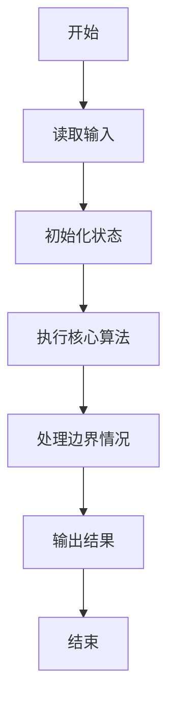
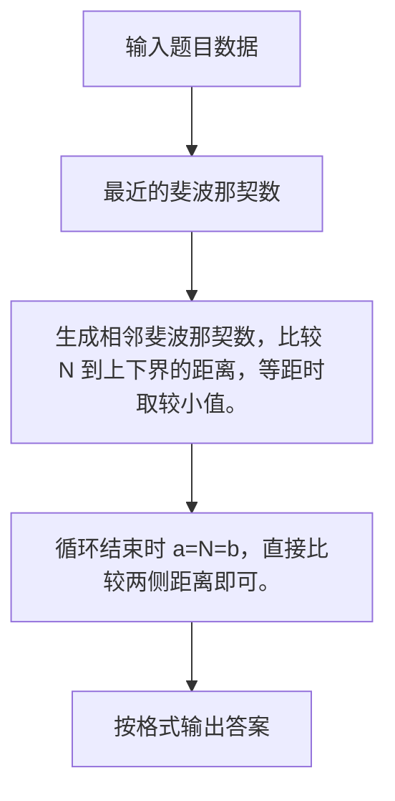

# 1124 最近的斐波那契数

- **分值：** 20分

### 题目描述

**斐波那契数列** $F_n$ 的定义为：对 $n\ge 0$ 有 $F_{n+2} = F_{n+1} + F_n$，初始值为 $F_0 = 0$ 和 $F_1 = 1$。所谓与给定的整数 $N$ **最近的斐波那契数**是指与 $N$ 的差之绝对值最小的斐波那契数。

本题就请你为任意给定的整数 $N$ 找出与之最近的斐波那契数。

### 输入格式：

输入在一行中给出一个正整数 $N$（$\le 10^8$）。

### 输出格式：

在一行输出与 $N$ 最近的斐波那契数。如果解不唯一，输出最小的那个数。

### 输入样例：
```
305
```

### 输出样例：
```
233
```

### 样例解释

部分斐波那契数列为 { 0, 1, 1, 2, 3, 5, 8, 13, 21, 34, 55, 89, 144, 233, 377, 610, ... }。可见 233 和 377 到 305 的距离都是最小值 72，则应输出较小的那个解。
<br/>
**感谢 江月 指出的题面错误！已于 25.3.13 修改。**


### 解题思路

生成相邻斐波那契数，比较 N 到上下界的距离，等距时取较小值。 循环结束时 a=N=b，直接比较两侧距离即可。

实现时按照题目的输入顺序读取数据，使用与数据规模匹配的数据结构保存必要状态，在遍历或模拟过程中完成核心计算，最后严格按照输出格式生成答案。

### 代码流程说明

1. 读取题目输入，初始化计数器、数组、集合或其他辅助状态。
2. 生成相邻斐波那契数，比较 N 到上下界的距离，等距时取较小值。
3. 循环结束时 a=N=b，直接比较两侧距离即可。
4. 根据题目要求处理边界情况，并输出最终结果。

时间复杂度为 O(log N)，空间复杂度主要取决于输入数据和辅助状态，通常为 O(1) 到 O(n)。

### 代码实现

以下是本题对应的完整 C++17 实现：

```cpp
#include <bits/stdc++.h>
using namespace std;
// 算法原理：生成相邻斐波那契数，比较 N 到上下界的距离，等距时取较小值。
// 关键步骤：循环结束时 a<=N<=b，直接比较两侧距离即可。
int main() {
    long long n;
    cin >> n;
    long long a = 0, b = 1;
    while (b < n) {
        long long c = a + b;
        a = b;
        b = c;
    }
    cout << (n - a <= b - n ? a : b);
}
```

### 代码流程图



### 解题流程图



### 常见易错点

- 注意输入规模，超大整数、长字符串或链表地址不能简单依赖普通整数和下标。
- 严格区分题目中的边界条件，例如是否包含等号、是否需要保留前导零以及是否只处理完整区块。
- 输出时按照题目规定的空格、换行、大小写和小数位数格式，避免计算正确但格式错误。
