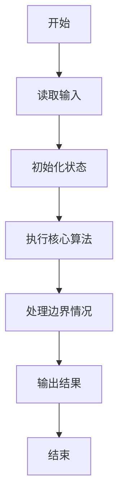
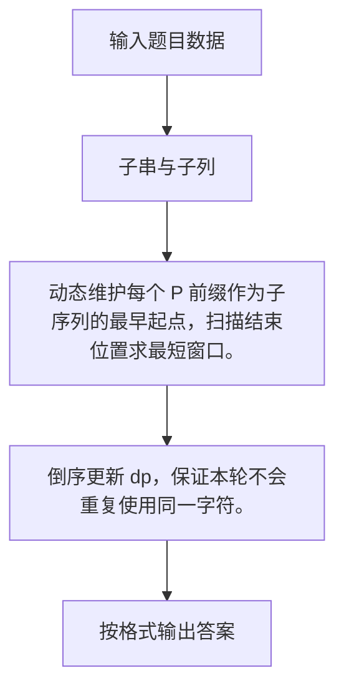

# 1125 子串与子列

- **分值：** 25分

### 题目描述

**子串**是一个字符串中连续的一部分，而**子列**是字符串中保持字符顺序的一个子集，可以连续也可以不连续。例如给定字符串 `atpaaabpabtt`，`pabt`是一个子串，而 `pat` 就是一个子列。

现给定一个字符串 $S$ 和一个子列 $P$，本题就请你找到 $S$ 中包含 $P$ 的最短子串。若解不唯一，则输出起点最靠左边的解。

### 输入格式：

输入在第一行中给出字符串 $S$，第二行给出 $P$。$S$ 非空，由不超过 $10^4$ 个小写英文字母组成；$P$ 保证是 $S$ 的一个非空子列。

### 输出格式：

在一行中输出 $S$ 中包含 $P$ 的最短子串。若解不唯一，则输出起点最靠左边的解。

### 输入样例：
```
atpaaabpabttpcat
pat
```

### 输出样例：
```
pabt
```


### 解题思路

动态维护每个 P 前缀作为子序列的最早起点，扫描结束位置求最短窗口。 倒序更新 dp，保证本轮不会重复使用同一字符。

实现时按照题目的输入顺序读取数据，使用与数据规模匹配的数据结构保存必要状态，在遍历或模拟过程中完成核心计算，最后严格按照输出格式生成答案。

### 代码流程说明

1. 读取题目输入，初始化计数器、数组、集合或其他辅助状态。
2. 动态维护每个 P 前缀作为子序列的最早起点，扫描结束位置求最短窗口。
3. 倒序更新 dp，保证本轮不会重复使用同一字符。
4. 根据题目要求处理边界情况，并输出最终结果。

时间复杂度为 O(|S||P|)，空间复杂度主要取决于输入数据和辅助状态，通常为 O(1) 到 O(n)。

### 代码实现

以下是本题对应的完整 C++17 实现：

```cpp
#include <bits/stdc++.h>
using namespace std;
// 算法原理：动态维护每个 P 前缀作为子序列的最早起点，扫描结束位置求最短窗口。
// 关键步骤：倒序更新 dp，保证本轮不会重复使用同一字符。
int main() {
    string s, p;
    cin >> s >> p;
    vector<int> dp(p.size(), -1);
    int best = INT_MAX, st = 0;
    for (int i = 0; i < (int)s.size(); ++i)
        for (int j = p.size() - 1; j >= 0; --j)
            if (s[i] == p[j]) {
                dp[j] = j ? dp[j - 1] : i;
                if (j == (int)p.size() - 1 && dp[j] >= 0) {
                    int len = i - dp[j] + 1;
                    if (len < best)
                        best = len, st = dp[j];
                }
            }
    cout << s.substr(st, best);
}
```

### 代码流程图



### 解题流程图



### 常见易错点

- 注意输入规模，超大整数、长字符串或链表地址不能简单依赖普通整数和下标。
- 严格区分题目中的边界条件，例如是否包含等号、是否需要保留前导零以及是否只处理完整区块。
- 输出时按照题目规定的空格、换行、大小写和小数位数格式，避免计算正确但格式错误。
